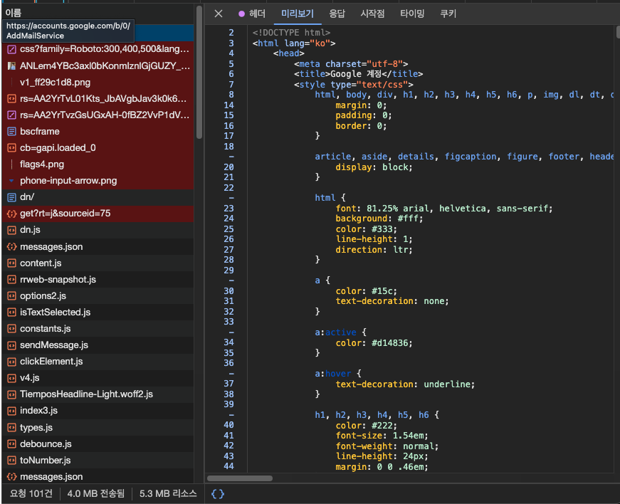
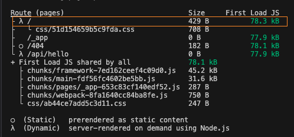
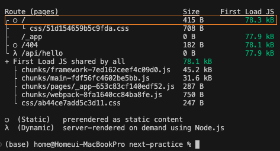
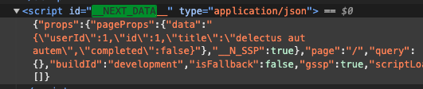
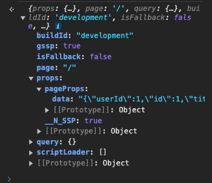

# 4. 서버 사이드 렌더링

## 싱글 페이지 애플리케이션

: 렌더링과 라우팅에 필요한 대부분의 기능을 서버가 아닌 브라우저의 자바스크립트에 의존하는 방식



- `gmail` : SPA로, 페이지 접속 시 서버로부터 html파일을 다운로드 받는다.
- 단점 : 최초에 로딩해야할 자바스크립트 리소스가 커진다.
- 장점 : 한 번 로딩된 이후에 서버를 거쳐 필요한 리소스를 받아올 일이 적어지기 때문에 사용자에게 훌륭한 UI/UX 제공

## 싱글 페이지 애플리케이션 등장의 역사

1. PHP, JSP 방식 : Javascript는 단순히 HTML 돔을 만지는 보조적인 수단
    - LAMP 스택 : Linux + Apache + MySQL + PHP
2. CommonJS, AMD(Asynchronous Module Definition) 등장
3. Backbone.js, AngularJS, Knockout.js 등장 
    - JAM 스택 : Javascript. +API + Markup 스택
4. JAM스택의 유행과 Node.js의 고도화
    - MEAN 스택 : MongoDB + Express.js + AngularJS + Node.js
    - MERN 스택 : MongoDB + Express.js + React + Node.js
5. 모바일에서 고도화된 웹사이트를 띄어야 함 → 모바일에서 모두 렌더링을 해야 하기에 느린 속도 → SSR의 등장 배경

## 서버 사이드 렌더링

: 최초에 사용자에게 보여줄 페이지를 서버에서 렌더링해 빠르게 사용자에게 화면을 제공하는 방식

### 장점

1. 최초 페이지 진입이 비교적 빠르다.
    - FCP(First Contentful Paint, 페이지에 유의미한 정보가 그려지는 시간)가 더 빨라질 수 있다.
    - SPA의 경우 해당 페이지 접근 > JS 리소스 다운로드 > HTTP 요청 수행 > 이 응답의 경과를 가지고 화면을 렌더링
    - 하지만 서버에서 HTTP 요청을 수행하는 것이 더 빠르고, 이 HTML을 그리는 작업도 서버에서 해당 HTML을 문자열로 미리 그려서 내려주는 것이 더 빠르다.
2. 검색 엔진과 SNS 공유 등 메타데이터 제공이 쉽다.
    - 검색 엔진이 사이트에서 필요한 정보 가져오는 과정
        1. 검색 엔진이 페이지에 진입
        2. 페이지가 HTML정보를 제공해 로봇이 이 HTML을 다운로드. 이 때, JS코드는 실행하지 않는다.
        3. 다운로드한 HTML에서 메타 데이터와 오픈그래프를 기반으로 페이지의 검색 정보를 가져오고, 이를 검색 엔진에 저장한다.
3. 누적 레이아웃 이동이 적다.
    - 요청이 완전히 완료된 이후에 페이지를 제공하기에 누적 레이아웃 문제가 발생하지 않는다.
        - 누적 레이아웃 문제 : API요청 응답 속도가 재각각이고, 이 API요청에 의존적이라면 발생
4. 사용자의 디바이스 성능에 비교적 자유롭다.
5. 보안에 좀 더 안전하다.

### 단점

1. 소스코드를 작성할 때 항상 서버를 고려해야 한다
    - `window`, `sessionStorage`같이 브라우저에만 있는 객체를 서버 사이드에서 실행할 수 없기에 이를 항상 고려해야 한다.
2. 적절한 서버가 구축돼 있어야 한다
    - 쿠버네티스 같은 여러 가지 라이브러리와 도구의 도움을 얻더라도 쉽지 않은 일이다.
3. 서비스 지연에 따른 문제
    - 사용자에게 보여줄 페이지에 대한 렌더링 작업이 끝나기까지는 사용자에게 그 어떤 정보도 제공할 수 없다.

### 결론

1. SPA와 SSR모두 알아야 한다. SSR이 만능이 아니기 때문이다. 잘못된 웹페이지 설계는 오히려 성능을 해칠 뿐 아니라 눈에 띄는 성능을 얻지 못하고, 관리 포인트만 늘어나게 된다.
2. 가장 뛰어난 SPA는 가장 뛰어난 MPA보다 낫다. 
    - 최초 페이지 진입시 보여줘야 할 정보만 최적화해 렌더링하고, 중요성이 떨어지는 리소스는 Lazy Loading으로 렌더링에 방해되지 않기 처리하고, 코드 스플리팅, 불필요한 JS리소스의 다운로드 및 실행을 방지 처리 한 SPA기준으로 말이다.
3. 평균적인 SPA는 평균적인 MPA보다 느리다.
    - 최근에는 MPA에서는 페인트 홀딩, back forward cache등의 다양한 API가 브라우저에 추가되고 있다.
4. 현대 Next.js같은 SSR프레임워크는 최초 페이지는 SSR방식, 그 이후 페이지 라우팅 시에는 SPA처럼 동작하여 두 가지 장점을 모두 취한다.

## SSR을 위한 리액트 API

1. `renderToString` : 인수로 넘겨받은 리액트 컴포넌트를 렌더링해 HTML 문자열로 반환
2. `renderToStaticMarkup` : 리액트에서만 사용하는 추가적인 DOM속성을 만들지 않는다.
    - 블로그 글이나 상품의 약관 정보와 같이 아무런 브라우저 액션이 없는 정적인 내용만 필요한 경우 유용하다.
3. `renderToNodeStream` : 브라우저에서 사용하는 것이 완전히 불가능하다.
    - renderToSTring의 결과물이 string인 반면, renderToNodeStream의 결과물은 Node.js의 ReadableStream이다. 이것은 utf-8로 인코딩된 바이트 스트림으로, Node.js환경에서만 사용할 수 있다. 브라우저가 원하는 결과물, 즉 string을 얻기 위해서는 추가적인 처리가 필요하다.
    - 스트림 : 큰 데이터를 다룰 때 데잍너를 청크로 분할해 조금씩 가져오는 방식
        - 청크 단위로 분리해 순차적으로 처리할 수 있다.
    - RSC는 renderToString 대신 renderToNodeStream을 채택하고 있다.
4. `renderToStaticNodeStream` : hydrate할 필요 없는 순수 HTML결과물이 필요할 때 사용
5. `hydrate` : 서버에서 생성된 HTML콘텐츠에 JS 핸들러나 이벤트를 붙이는 역할
    - 렌더링 결과물 HTML과 인수로 넘겨받은 HTML을 비교하는 작업을 수행한다. 이 때 불일치가 발생하면 에러가 발생하며, 이러한 경우 useEffect를 통해 브라우저에서만 노출하면 된다.

### React - SSR 예시

https://github.com/solo5star/react-ssr-counter-example

- 서버 : express로 띄움

## Next.js

: Vercel에서 만든 리액트 기반 서버 사이브 렌더링 프레임워크

### 각 파일에 대한 설명

- `package.json` : 프로젝트 구동에 필요한 모든 명령어 및 의존성 포함
- `next.config.js` : Next.js 프로젝트의 환경 설정 담당
    - reactStrictMode : 리액트의 엄격모드와 관련된 옵션. 켜두는 것이 도움이 된다
    - swcMinify : SWC 기반으로 코드 최소화 작업을 할 것인지 여부를 설정
        - SWC : Javascript 기반의 바벨과 달리, Rust기반으로 작성하여 C/C++과 동등한 수준의 속도를 보여준다.
            - 병렬로 작업을 추리한다.
            - 번들링과 컴파일을 더욱 빠르게 수행한다.
- `pages/_app.tsx` : 전체 페이지의 시작점
    - Error Boundary를 사용해 애플리케이선 전역에서 발생하는 에러 처리
    - reset.css같은 전역 CSS 선언
    - 모든 페이지에 공통으로 사용 또는 제공해야 하는 데이터 제공
- `pages/document.tsx` : App.tsx와 달리 무조건 서버에서 실행된다.
    - html, body에 DOM속성을 추가하고 싶다면 사용
    - CSS-in-JS의 스타일을 서버에서 모아 HTML로 제공
- `pages/error.tsx` : 클라이언트에서 발생한 에러 또는 서버에서 발생한 500에러를 처리
- `pages/404.tsx`, `pages/500.tsx` : 404나 500에러를 핸들링하는 페이지

- `pages/index.tsx` : 각 페이지에 있는 default export로 내보낸 함수가 해당 페이지의 루트 컴포넌트가 된다.

### Link태그

- Link태그는 클라이언트에서 필요한 자바스크립트만 불러온 뒤 라우팅하는 클라이언트 라우팅/렌더링 방식으로 작동한다.
- 내부 페이지 이동 시, <a> 대신 <Link>를, window.location.push 대신 router.push를 사용한다.

### getServerSideProps사용시 : 서버에서 동적 생성

```tsx
import styles from "../styles/Home.module.css";

export default function Home() {
  return <div className={styles.container}></div>;
}
```



### getServerSideProps 미사용 시 : 서버에서 정적 생성



getServerSideProps가 없다면 서버에서 실행하지 않아도 되는 페이지로 처리한다. 

`typeof window`의 처리 같은 경우 모두 object로 바꾼 다음, 빌드 시점에 트리쉐이킹으로 처리한다

- **트리쉐이킹** : 번들링 과정에서 불필요한 코드를 식별하고 제거하는 기법

### /api/*.ts

서버에서 내려주는 데이터를 조합해 BFF형태로 활용하거나, 완전한 풀스택 애플리케이션을 구축하고 싶을 때, 혹은 CORS를 우회하기 위해 사용할 수 있다.

### Data fetching

1. `getStaticPaths`, `getStaticProps` : 블로그, 게시판과 같이 사용자와 관계없이 정적으로 결정된 페이지를 보여주고자할 때 사용하는 함수
2. `getServerSideProps` : 서버에서 실행되는 함수이며 해당 함수가 있다면 무조건 페이지 진입 전에 이 함수를 실행한다.
3. `getInitialProps` :위 함수들이 나오기 전에 사용할 수 있었던 유일한 페이지 데이터 불러오기 수단
    - 사용을 권장하지 않는다
    - _app.tsx나 _error.tsx와 같이 사용이 제한돼 있는 페이지에서만 사용하는 것이 좋다
    - 코드에 따라 서버와 클라이언트 모두에서 실행될 수 있다.
        - 최초 진입시에는 서버에, 그 이후 클라이언트에서 라우팅을 수행한다

```tsx
export default function Home({ data }) {
  console.log(data);
  return <div className={styles.container}></div>;
}

export const getServerSideProps = async (context) => {
  const {
    query: { id = "" },
  } = context;
  const response = await fetchData();

  return {
    props: { data: JSON.stringify(response) },
  };
};
```



`<script id=”__NEXT_DATA__” ></script>` 내부에 서버에서 미리 받아온 데이터를 script에 담아서 보내주는 것을 확인할 수 있다.

Next.js는 React의 서버사이드 렌더링과 다르게, 서버에서 f etch 등으로 받아온 데이터를 HTML에 script에 내려주어, 클라이언트에서 데이터 fetching을 다시 수행하지 않는다. 이 정보를 Next.js는 window객체에 저장해둔다.



1. 일반적인 JSX와는 다르게 getServerSideProps의 props로 내려줄 수 있는 값은 JSON으로 제공할 수 있는 값으로 제한된다.
    1. class나 Date등은 props로 제공할 수 없으며, JSON.stringify로 직렬화할 수 있는 값만 제공해야 한다.
    2. 값에 대한 가공은 실제 페이지나 컴포넌트에서 하는 것이 옳다.
2. 서버 측 함수가 실행이 끝나기 전까지는 사용자에게 어떠한 HTML도 보여줄 수 없기에, 꼭 최초에 보여줘야 하는 페이지가 아니라면 getServerSideProps보다는 클라이언트에서 호출하는 것이 더 유리하다.