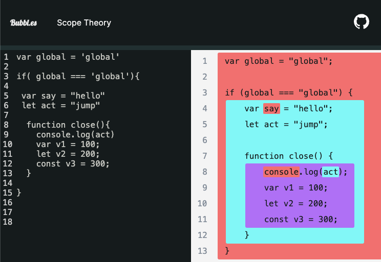

# 1\_리액트 개발을 위해 꼭 알아야 할 자바스크립트

**목차**
- [1.자바스크립트의 동등 비교](#1자바스크립트의-동등-비교)
  - [리액트에서의 자바스크립트 동등 비교](#리액트에서의-자바스크립트-동등-비교)
  - [자바스크립트의 데이터 타입](#자바스크립트의-데이터-타입)
  - [자바스크립트의 값 비교](#자바스크립트의-값-비교)
  - [리액트 값비교](#리액트-값비교)
  - [정리](#정리)
- [2.함수](#2함수)
  - [함수를 정의하는 방식](#함수를-정의하는-방식)
  - [리액트 함수형 컴포넌트 설계](#리액트-함수형-컴포넌트-설계)
- [3.클래스](#3클래스)
- [4.클로저](#4클로저)
- [5.이벤트 루프와 비동기 통신의 이해](#5이벤트-루프와-비동기-통신의-이해)
- [6.리액트에서 자주 사용하는 자바스크립트 문법](#6리액트에서-자주-사용하는-자바스크립트-문법)
  - [배열 구조분해 할당 (ES6)](#배열-구조분해-할당-es6)
  - [객체 구조분해 할당 (ECMA2018)](#객체-구조분해-할당-ecma2018)
  - [Array 프로토타입의 메서드](#array-프로토타입의-메서드)
  - [삼항 조건 연산자](#삼항-조건-연산자)
- [7. 선택이 아닌 필수, 타입스크립트](#7-선택이-아닌-필수-타입스크립트)
  - [타입스크립트란?](#타입스크립트란)
  - [리액트 코드를 효과적으로 작성하기 위한 타입스크립트 활용](#리액트-코드를-효과적으로-작성하기-위한-타입스크립트-활용)
  - [타입스크립트로 전환하기](#타입스크립트로-전환하기)

---

## 1.자바스크립트의 동등 비교

### 리액트에서의 자바스크립트 동등 비교

- 리액트의 가상 DOM 과 실제 DOM 의 비교
- 컴포넌트 props 객체의 얕은 비교에 따라 랜더링 여부 결정
- 변수나 함수의 메모이제이션

### 자바스크립트의 데이터 타입

객체 타입은 참조값 저장방식으로, 보이는 형태가 동일해도 참조값이 다르면 같지 않다.

#### 원시 타입

- 종류
  - boolean, null, undefined, number, string, symbol, bigint
- null과 undefined의 차이
  - null 은 명시적으로 비어있음을 나타내며, undefined는 선언되었지만 할당되지않은 값
- truthy , falsy 값
  - boolean 의 true, false 외에도 조건문에서 true, false 처럼 취급되는 값
  - truthy 값의 예로는 1, {}, []
  - falsy 값의 예로는 0, NaN, "", null, undefined
- BigInt (ES2020)
  - number가 다룰 수 있는 숫자 크기(-2^53 ~ 2^53-1)의 제한을 극복하기 위해 나옴
  ```js
  // 사용방법
  const bigInt1 = 903290293402934034234n;
  const bigInt2 = BigInt("903290293402934034234");
  ```
- String
  템플릿 리터럴
  `` js
const longText = `
띄어쓰기와 ${'표현식'+'사용이'} 가능하다.
` ``
- Symbol (ES6)
  ```js
  // 같은 인수도 고유한 값으로 만들어 준다.
  const key1 = Symbol("key");
  const key2 = Symbol("key");
  key1 === key2; // false
  ```

#### 객체 타입

- 참조 타입 : 참조를 전달한다.

#### 값을 저장하는 방식의 차이

- 원시 타입은 값이 불변 형태의 값으로 저장. 변수 할당 시점에 메모리 영역을 차지함
- 객체 타입은 프로퍼티를 나중에도 변경할 수 있게 저장되고, 참조값을 전달합니다.

### 자바스크립트의 값 비교

#### 객체의 동등비교

```js
// 동일한 내용을 저장해도 참조 값이 다르면 당연히 같지 않다.
const a = { content: "a" };
const a2 = { content: "a" };
a === a2; // false
a3 = a;
a === a3; // true
```

**Object\.is ( ES6 )**

- 리액트에서 동등비교를 할때 사용된다.
- `===` 가 개발자의 기대대로 작동하지 않는 몇가지 특이 케이스들이 추가된 비교 메서드이다.
- 객체 비교에 있어서는 `===` 와 동일하다.

```js
console.log(Object.is("1", 1));
// Expected output: false

console.log(Object.is(NaN, NaN));
// Expected output: true

console.log(Object.is(-0, 0));
// Expected output: false

const obj = {};
console.log(Object.is(obj, {}));
// Expected output: false
```

[mdn- Object.is() ](https://developer.mozilla.org/ko/docs/Web/JavaScript/Reference/Global_Objects/Object/is)

### 리액트 값비교

**shallowEqual**

- 리액트에서는 shallowEqual 함수를 값을 비교해야하는 곳에서 사용한다
- shallowEqual 함수는 자바스크립트 Object\.is 매서드와 객체 비교 로직을 포함한다.

**shallowEqual - Object\.is**

- Object\.is 가 ES6에서 도입되어 ES6 를 지원하지 않는 브라우저를 위해 리액트는 polyfill 을 같이 사용했다.
- 2023.12 기준, 대표 5개 브라우저들의 최신버전은 Object\.is 를 모두 지원한다.

```js
/**
 * inlined Object.is polyfill to avoid requiring consumers ship their own
 * https://developer.mozilla.org/en-US/docs/Web/JavaScript/Reference/Global_Objects/Object/is
 */
function is(x: any, y: any) {
  return (
    (x === y && (x !== 0 || 1 / x === 1 / y)) || (x !== x && y !== y) // eslint-disable-line no-self-compare
  );
}

const objectIs: (x: any, y: any) => boolean =
  // $FlowFixMe[method-unbinding]
  typeof Object.is === "function" ? Object.is : is;

export default objectIs;
```

**shallowEqual - 객체 비교**

- 참고자료의 shallowEqual 함수의 코드를 보면, 객체 비교는 깊이1 까지 비교 해준다.
- 왜? 얉은 비교 ( 깊이 1 )까지 만 구현했을까?
  - 리액트의 props가 객체인데, 중첩된 객체가 끝없이 존재할 수 있기에 그렇게 되었을 때의 성능저하로, 한계를 둔게 아닐까?
- 아래의 Code1_3을 테스트해보면, DeeperComponent의 counter prop 에 전달되는 {counter:100} 객체가 매번 새로 생성된다. React.memo 를 이용해서 값 비교했을 때, 참조값이 다르니 매번 재랜더링 되는 것이다.
  - 의도한대로 하려면 Code1_3_2 처럼 하면 되겠다.

```tsx
import { memo, useState } from "react";
type Props = { counter: number };
const Component = memo((props: Props) => {
  console.log("render component");
  return <div>component counter is {props.counter}</div>;
});

type DeeperProps = { counter: { counter: number } };
const DeeperComponent = memo((props: DeeperProps) => {
  console.log("render deeper component");
  return <div>component counter is {props.counter.counter}</div>;
});

function Code1_3() {
  const [, setCounter] = useState(0);
  return (
    <div className="App">
      <Component counter={100} />
      <DeeperComponent counter={{ counter: 100 }} />
      <button
        onClick={() => {
          setCounter((prev) => prev + 1);
        }}
      >
        render
      </button>
    </div>
  );
}

function Code1_3_2() {
  const [, setCounter] = useState(0);
  const counter = useMemo(() => ({ counter: 100 }), []);

  return (
    <div className="App">
      <Component counter={100} />
      <DeeperComponent counter={counter} />
      <button
        onClick={() => {
          setCounter((prev) => prev + 1);
        }}
      >
        render
      </button>
    </div>
  );
}
```

[react- shallowEqual 함수 ](https://github.com/facebook/react/blob/main/packages/shared/shallowEqual.js)
[참고링크: react-objectIs polyfill](https://github.com/facebook/react/blob/main/packages/shared/objectIs.js)

### 정리

리액트 랜더링 최적화를 위해서, 리액트의 비교 방식과 그 내부의 자바스크립트의 비교방식을 알면
React.memo, useMemo, useCallback 의 필요성과 사용법을 쉽게 이해할 수있다.

## 2.함수

함수형 컴포넌트를 작성할 때, 일반함수와 화살표형 함수를 섞어서 쓴다. 둘의 차이는 뭘까?

### 함수를 정의하는 방식

**함수 선언문**

- 함수 선언문의 경우에는 호이스팅이 일어난다.
  - 함수 호이스팅의 범위는?
    - 함수나 블록내부가 아닌 스크립트에서 선언되면 스크립트의 최상위로 끌어올려진다.
    - 함수나 블록내부에 선언되면 해당 블록 스코프의 최상위로 끌어 올려진다.

```js
add();

function add(a, b) {
  return a + b;
}
```

**함수 표현식**

- 자바스크립트의 함수는 일급객체여서 함수 표현식이 가능 ( 매개변수, 반환값, 할당값으로 사용가능)
- var 로 함수를 변수에 할당하면, 변수 선언만 호이스팅이 된다. 즉 할당문이 실행될 때, multiply 변수에 할수가 할당되어 호출할 수있는 것이다.

```js
const sum = function (a, b) {
  return a + b;
};

console.log(multiply); // undefined

var multiply = function (a, b) {
  return a * b;
};
```

**화살표 함수**

- 화살표 함수는 constructor 함수로 사용할 수 없다.
- arguments 가 존재 하지 않는다.
- 화살표 함수 함수와 일반함수의 큰 차이점은 this 바인딩이다.
  - 함수 내부의 this 는 호출 방법에 따라 좌우된다.
  - 화살표함수의 this는 상위 스코프의 this 를 그대로 따른다.

아래의 class component 에서 일반함수 handleIncrementFn 는 버튼이 클릭되며, 일반함수 호출로 실행이 되기 때문에, this는 window 거나, strict mode 에서는 undefined 가 되게 되어, Counter 내부의 state 에 접근을 할 수 가 없다.

```tsx
import React, { Component } from "react";

interface CounterState {
  count: number;
}

class Counter extends Component<{}, CounterState> {
  constructor(props: {}) {
    super(props);
    this.state = {
      count: 0,
    };
  }

  handleIncrementFn() {
    this.setState((prevState) => ({
      count: prevState.count + 1,
    }));
  }

  handleIncrement = () => {
    this.setState((prevState) => ({
      count: prevState.count + 1,
    }));
  };

  render() {
    return (
      <div>
        <h1>Count: {this.state.count}</h1>
        <button onClick={this.handleIncrement}>Increment</button>
      </div>
    );
  }
}

export default Counter;
```

[mdn-operators/this](https://developer.mozilla.org/ko/docs/Web/JavaScript/Reference/Operators/this)

**Function 생성자**

- 기존 함수 작성법과는 다르고, 클로저도 적용되지 않아서, 이 방식은 권장되지 않는다.

### 리액트 함수형 컴포넌트 설계

- 함수형 컴포넌트를 만들때, 순수함수처럼 순수성을 지켜주는 것은 버그를 줄이고 리액트의 성능을 최대화 시켜준다.
  - 외부의 객체나 변수를 변경시키지 않는다.
  - 같은 input (props) => output (JSX) 가 예측이 되어야한다.
- 부수효과가 없을 수는 없다. 외부에서 데이터를 가지고오거나, 스크린을 변경해야하니
  - 이벤트 핸들러에 부수효과를 넣자
  - 이벤트 핸들러에 넣을 수 없는 경우 useEffect 에 넣자.
  - [react-keeping-components-pure](https://react.dev/learn/keeping-components-pure)

```jsx
// 다음은 부수효과로 랜더링이 여러번 일어나는 코드
export default function StoryTray({ stories }) {
  stories.push({
    id: "create",
    label: "Create Story",
  });

  return (
    <ul>
      {stories.map((story) => (
        <li key={story.id}>{story.label}</li>
      ))}
    </ul>
  );
}
```

- useEffect 나 useCallback 등 훅에 넘겨주는 콜백함수에도 네이밍을 붙여주면 가독성에 도움이 된다.

```jsx
useEffect(function apiRequest() {}, []);
```

Q. 다들 업무나 프로젝트를 할때 어떻게 컨벤션 규칙을 정하고, 어떤 규칙을 사용하고 있으신가요?
Q. 한글 변수 네이밍 ? terser ? 정말 한글로 코딩하는 날이 올 수 있을까 ?

## 3.클래스

클래스에 대해 이해하면, 16.8 이전, 클래스 컴포넌트를 사용한 코드를 이해하고 리팩토링을 할 수 있다.

- 리액트 클래스형 컴포넌트를 이해하는데는 클래스, 프로토타입, this에 대한 이해가 필요하다.
- 왜 리액트가 함수형으로 패러다임을 바꿨는지도 클래스형 컴포넌트를 보며 생각해보자.

클래스란, 특정 객체를 반복적으로 만들기 위해 사용되는 템플릿 ES6 이전에는, 클래스 개념이 도입되기 전으로, 함수가 클래스 같은 역할도 했다.

```jsx
class Cat {
  name;
  #age;
  //생성자: 객체를 생성하는데 사용하는 특수한 메서드
  constructor(name, age) {
  //프로퍼티 : 인스턴스를 정의 할 때 내부에 정의 하는 속성값
    this.name = name;
    this.#age = age;
  }

  // getter : 클래스의 값을 가지고 올때 사용
  get age() {
    return this.#age;
  }

  // setter : 클래스 필드에 값을 할당할 때 사용
  set age(newAge) {
    if (newAge >= 0) {
      this.#age = newAge;
    } else {
      console.error('Age cannot be negative.');
    }
  }
 // 인스턴스 메서드
  meow() {
    console.log(`${this.name} says: Meow!`);
  }
  // 정적 메서드
  static createKitten() {
    return new Cat('Kitten', 0);
  }
}

// https://babeljs.io/repl
// 바벨 변환시 _createClass 헬퍼함수를 이용해서 class 처럼 동작하게 한다.

var Cat = /*#__PURE__*/function () {
  //생성자: 객체를 생성하는데 사용하는 특수한 메서드
  function Cat(name, age) {
    _classCallCheck(this, Cat);
    _defineProperty(this, "name", void 0);
    _classPrivateFieldInitSpec(this, _age, {
      writable: true,
      value: void 0
    });
    //프로퍼티 : 인스턴스를 정의 할 때 내부에 정의 하는 속성값
    this.name = name;
    _classPrivateFieldSet(this, _age, age);
  }

  // getter : 클래스의 값을 가지고 올때 사용
  _createClass(Cat, [{
    key: "age",
    get: function get() {
      return _classPrivateFieldGet(this, _age);
    }

    // setter : 클래스 필드에 값을 할당할 때 사용
    ,
    set: function set(newAge) {
      if (newAge >= 0) {
        _classPrivateFieldSet(this, _age, newAge);
      } else {
        console.error('Age cannot be negative.');
      }
    }
    // 인스턴스 메서드
  }, {
    key: "meow",
    value: function meow() {
      console.log("".concat(this.name, " says: Meow!"));
    }
    // 정적 메서드
  }], [{
    key: "createKitten",
    value: function createKitten() {
      return new Cat('Kitten', 0);
    }
  }]);
  return Cat;
}();
}
```

**인스턴스 메서드**

- 클래스를 이용해 만든 객체( 인스턴스 ) 에서 접근할 수 있는 메서드
- prototype 에 함수가 등록되어 프로토타입 체이닝 ( 자기자신 부터 최상위 객체 까지 프로토타입을 타고 가며 메서드를 호출)을 통해 인스턴스에서 메서드 사용이 가능하다. - `Object.getPrototypeOf(Cat)` - `Cat.prototype`
  정적 메서드
- 클래스의 이름으로 호출가능한 매서드, 인스턴스 생성없이 재사용이 가능해서 유틸함수에 많이 활용됨
- 정적 메서드 내부의 this는 인스턴스가 아닌 클래스 자신을 가리키기 때문에 클래스형 컴포넌트 생명주기 메서드인 static getDerivedStateFromProps(props, state) 에서는 this.state 에 접근할 수 없다.

클래스형 리액트 컴포넌트

- Component 클래스를 상속해서 각종 생명주기 메서드와 기타기능을 활용할 수 있다.
- 클래스형 컴포넌트의 함수 작성시, this binding 을 고려해야한다. 화살표함수와 일반함수, 인스턴스 메서드냐 정적 매서드냐 등을 모두 고려해야한다. 함수형 컴포넌트는 this 사용을 제거해서 코드를 더 단순하게 만들었다.

## 4.클로저

함수형 컴포넌트에 대한 이해는 클로저에 달려있다. 클로저를 이해하면, 함수형 컴포넌트의 구조와 작동방식, 훅의 원리, 의존성 배열 등 함수형 컴포넌트를 이해하는데 도움이 된다.

클로저란, 함수와 함수가 선언된 어휘적 환경의 조합이다.

- 함수가 생성될때 closure 도 생성된다.
- 내부 함수에서 외부 함수의 scope 에 접근할 수 있게 해주는 것이 closure 이다.

**스코프**

- ES6 전에는 전역스코프 (Global Scope) 과 함수 스코프 (Function Scope) 만 있었다.
- ES6 이후 let 과 const 가 들어오면서 Block Scope 도 제공된다.

- 전역 스코프 : 전역 레벨에 선언하면, 어디서든 사용이 될 수 있다. 브라우저 환경에서 전역 객체는 window , Node.js 에서는 global 객체에 바인딩 된다. => 아래 예제에서 global 변수가 전역 스코프를 가진다.
- 함수 스코프 : 자바스크립트는 각 함수별로 스코프를 가진다. 함수 안에서 선언하면, 함수안에서만 사용할 수 있다. => 함수 close 안에 선언된 v1, v2, v3 모두 close 함수 스코프를 가진다.
- 블록 스코프 : let, const 변수에 한해서 {} block scope 을 가진다.



스코프를 활용한 팩토리 패턴의 코드이다. counter1 , counter2 는 각각의 함수 스코프를 가져서 각자만의 privateCounter와 changeBy 함수를 가진다.

```js
const makeCounter = function () {
  let privateCounter = 0;
  function changeBy(val) {
    privateCounter += val;
  }
  return {
    increment() {
      changeBy(1);
    },

    decrement() {
      changeBy(-1);
    },

    value() {
      return privateCounter;
    },
  };
};

const counter1 = makeCounter();
const counter2 = makeCounter();

console.log(counter1.value()); // 0.

counter1.increment();
counter1.increment();
console.log(counter1.value()); // 2.

counter1.decrement();
console.log(counter1.value()); // 1.
console.log(counter2.value()); // 0.
```

**리액트에서의 클로저**

- setState 함수가 계속해서 최신 state 값에 접근을 할 수 있는 것은, state 가 저장되어 있는 환경을 계속해서 기억하는 closure 때문이다.

<참고 자료>
[mdn-closures](https://developer.mozilla.org/en-US/docs/Web/JavaScript/Closures)
[scope 시각화](https://jsbubbl.es/)

## 5.이벤트 루프와 비동기 통신의 이해

자바스크립트는 싱글 스레드에서 작동한다. 한번에 하나의 작업을 동기방식으로 처리한다는 것이다.
하지만 브라우저에 올리는 웹 어플리케이션에는 데이터 fetching 등 비동기 방식으로 작동하는 부분이 있다.

- 런타임 엔진에서 이벤트 루프가 태스크큐, 마이크로태스크큐, 애니메이션 프레임 에 쌓인 작업을 확인하면서
  비동기로 작동하게 합니다.
- 이벤트 루프는 전체 코드를 실행하고, 호출 스택이 비었을 때, 마이크로태스크 큐 -> 애니메이션 프레임->태스크 큐 순서로 작업을 수행합니다.

```js
// (1) 콜스택에 들어 갔다가, 실행
console.log("start");

// (2) 콜백함수가 태스크 큐에 들어갑
// (9) 이벤트 루프가 테스크 큐를 확인해서 태스크를 콜스택으로 이동 실행
setTimeout(() => {
  console.log("timeout a");
}, 0);

// (3) then callback  마이크로 테스크 큐에 들어감
// (7) 이벤트 루프가 마이크로테스크 큐를 확인해서 콜스택으로 이동
Promise.resolve().then(() => {
  console.log("resolve");
});

// (4) 애니메이션 프레임에 콜백함수 들어감
// (8) 이벤트 루프가 렌더링전에 애니메이션 프레임 큐를 확인해서 콜스택으로 이동
window.requestAnimationFrame(() => {
  console.log("animate");
});

// (5) 콜백함수가 태스크 큐에 들어감
// (10) 이벤트 루프가 테스크 큐를 확인해서 콜스택으로 이동 실행
setTimeout(() => {
  console.log("timeout b");
}, 0);

// (6) 콜백택에 들어 갔다가, 실행
console.log("end");

// 로그 순서
/*
 *  start
 *  end
 *  resolve
 *  animate
 *  timeout a
 *  timeout b
 *
 */
```

<참고자료>

- 시각화 자료: https://velog.io/@titu/JavaScript-Task-Queue말고-다른-큐가-더-있다고-MicroTask-Queue-Animation-Frames-Render-Queue
- 시각화자료: https://dev.to/lydiahallie/javascript-visualized-promises-async-await-5gke
- 이제는 브라우저 API의 WebWorker 를 활용하면 제한된 인터페이스와 함수이지만 메인쓰레드와 멀티쓰레드로 여러 작업을 처리할 수 있다.

## 6.리액트에서 자주 사용하는 자바스크립트 문법

### 배열 구조분해 할당 (ES6)

- react 의 useState 의 state 와 setState를 가지고 올 때, 사용되는 문법
- 변수이름을 안적으면 중간 인덱스 할당은 생략할 수 있다.
- 기본값을 줄 수도 있다.
- 전개연산자를 마지막에 선언해서 배열을 반환 받을 수도 있다.

```js
const [, second = 20, , ...extra] = [1, 2, 3, 4, 5, 6];
console.log(second); //20
console.log(extra); // [4,5]
```

### 객체 구조분해 할당 (ECMA2018)

- react 의 props 값을 바로 사용할 수 있게 해줍니다.
- 실제 객체의 속성값으로 값 가져오기를 합니다.
- 배열의 구조분해할당 처럼 기본값지정, 전개연산자로 나머지 부분을 객체로 가지고 오기가 가능합니다.

```jsx
function Header({ user, logo }) {
  const sampleObj = { a: "A", b: undefined, c: "C", d: "D", e: "E" };
  const { a: newName, b = "initial value", c, ...extra } = sampleObj;
  console.log(newName, b, c, extra); // A initial value C {d: 'D', e: 'E'}

  // 계산된 속성으로 값을 가지고오는 것도 가능합니다.
  const key = "c";
  const { [key]: myVal } = sampleObj;
}
```

객체 구조분해 할당, 객체 전개구문 을 바벨로 ES5로트랜스파일을 해보면, 처리하는 함수가 복잡해 번들링 사이즈가 커진다. 만약 웹 개발 환경이 ES5 를 고려해야하는 상황이라면, 꼭 필요한 지 검토해 보자. lodash 나 ramda 같은 utils 로 대체가 가능할 수도 있다.

### Array 프로토타입의 메서드

- map, filter, reduce : JSX 내부에서 배열을 조작해 바로 JSX 를 반환할 수 있는 특성상 react 에서 자주 쓰인다.
- forEach : 실행되는 순간 break, return 그 무엇도 배열 순회를 멈출 수 없다. 무조건 O(n) 만큼 실행되기 때문에, 코드 작성시 최적화 가능성을 꼭 검토해보자 !!

### 삼항 조건 연산자

` 조건문 ? 참일 때 값 : 거짓일 때 값`

- 삼항조건은 리액트의 jsx 를 조건부로 랜더링 할 때 사용하는데, 이를 중첩해서 사용하는 것은 가독성을 해친다.
- 어떤 방식으로 조건부 랜더링을 할 수 있을까?
  - JSX 외부에서 if 나 switch 문을 사용해서 jsx 를 반환하는 함수를 만들어서 사용하면 된다.

##7. 선택이 아닌 필수, 타입스크립트

### 타입스크립트란?

- 기존 자바스크립트에 타입을 가미 한 자바스크립트의 슈퍼셋
- 런타임이 아닌 빌드(트랜스파일)타임에 타입체크를 한다.
- 타입스크립트 이전에 Flow 라는 메타에서 만들어진 정적타입체크 라이브러리를 사용했고, 리액트도 Flow 로 작성되어있는데, @types/react 라이브러리의 등장으로 리액트도 타입스크립트 사용을 잘 지원하고 있다.

### 리액트 코드를 효과적으로 작성하기 위한 타입스크립트 활용

any를 쓰면 정적 타이핑의 이점이 없다. 어떤 타입인지 정의 하기 어려우면 any 대신 unknown 을 사용한 다음, type을 좁히자.

**제네릭**
함수나 클래스 내부에서 다양한 타입에 대응할 수 있게 도와주는 도구

```
function multiGeneric<T1,T2>(a:T1, b:T2):[T1,T2]{
  return [a,b]
}

const result = multiGeneric<number,boolean>(1,true)
```

**인덱스 시그니처**
객체의 키를 정의 하는 방식

```ts
//record  사용하기
type Cat = Record<"name" | "age", string>
//타입을 사용한 인덱스 시그니처
type Cat = { [key in "name" | "age"]: string };

const meo: Cat = { name: "Meo", age: "5" };

Object.keys(meo).map((key)=>{ 
    console.log(meo[key])  // Element implicitly has an 'any' type because expression of type 'string' can't be used to index type 'Cat'.
});
```

위와 같이 Cat 객체의 타입을 명확하게 정의 했지만 Object.keys() 가 반환하는 타입이 string[] 으로 고정이 되어 있기 때문에, 아래와 같이 타입을 강제해주는 것이 필요하다.

```ts 

function keysOf<T extends Object>(obj: T): Array<keyof T> {
  return Array.from(Object.keys(obj)) as Array<keyof T>;
}

keysOf(meo).map((key) => {
  console.log(meo[key]);
});

(Object.keys(meo) as Array<keyof Cat>).map((key) => {
  console.log(meo[key]);
});

//
```

**타입스크립트 덕 타이핑**

덕타이핑, 구조적 서브타이핑 : 타입스크립트가 타입체크를 할 때, 그 값이 가진 형태에 집중하는 원칙
- 모든 키가 들어올 수 있는 가능성이 열려 있는 객체의 키에 포괄적으로 대응하기 위해 타입을 제공함 

```ts
type Car = { name: string };
type Truck = { name: string; power: number };

function logName(car: Car) {
  console.log(car.name);
}
const truck: Truck = { name: "volvo", power: 100 };

logName(truck);
```
- 아래의 예제에서 Car 가 아닌 Truck 이 들어오는 데도 Car 의 타입을 모두 가지고 있기 때문에, 타입오류가 발생하지 않는다.
- 정확한 타입 반환에 대한 필요는 Exact 타입을 요청하는 이슈에서 확인 가능하다.
https://github.com/microsoft/TypeScript/issues/12936

### 타입스크립트로 전환하기

이미 자바스크립트로 운영하고 있는 프로젝트를 타입스크립트로 전환할 때의 가이드이다.

1. tsconfig.json 에 다음과 같은 설정을 작성한다.

- 타입스크립트 컴파일러로 변환할 파일
- 어떤 js버전으로 변환할 것인지
- js 파일을 허용할 것인지
- 최종 결과물의 경로

2. JSDoc 과 @ts-check 을 이용하면, ts 가 아니어도 타입스크립트 컴파일러가 JS Doc 을 활용해서 타입을 확인한다.
3. 타입기반의 라이브러리 사용을 위해 @types 모듈 설치하기
4. 별도의 의존성을 가지고 있지 안는 상수, 유틸 파일 부터 시작해서 하나의 파일씩 바꿔나가면 된다.

**질문들**
Q. 브라우저에서 지원 여부에 따라 바벨의 트랜스파일, polyfill 과 이를 최적화하는 것을 권장하던데, 정말 이런것들을 고민해야하는 경우가 언제 있을까? 실제 경험담을 듣고 싶다.

Q. OOP, 함수형 프로그래밍은 보통 섞어서 쓴다는데, 다들 어떤 식으로 쓰는지 궁금하다.
