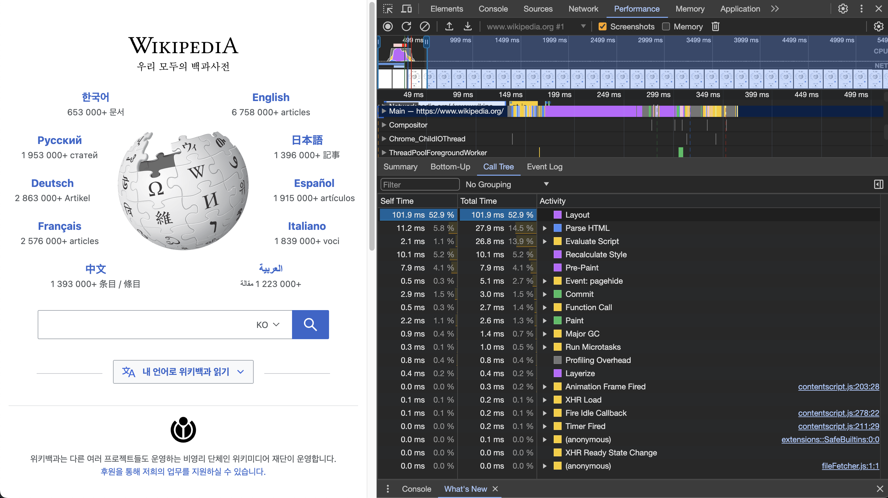
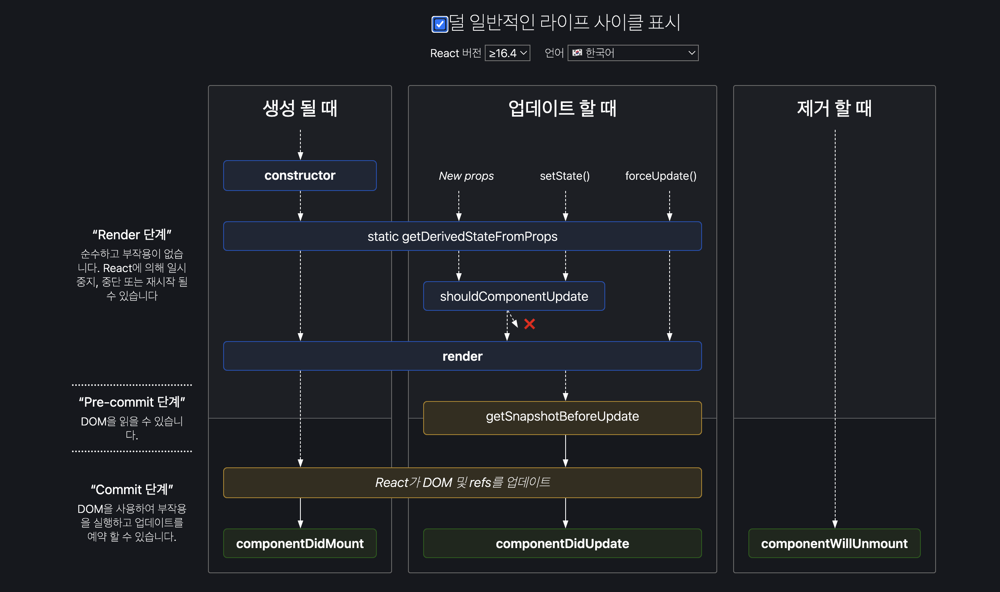

# 2\_리액트 핵심 요소 깊게 살펴보기

목차

<!-- @import "[TOC]" {cmd="toc" depthFrom=2 depthTo=3 orderedList=false} -->

<!-- code_chunk_output -->

- [2.1 JSX 란?](#21-jsx-란)
  - [JSX의 정의](#jsx의-정의)
  - [JSXAttributes](#jsxattributes)
  - [JSXChildren](#jsxchildren)
  - [JSX 예시](#jsx-예시)
  - [JSX는 어떻게 자바스크립트에서 변환될까?](#jsx는-어떻게-자바스크립트에서-변환될까)
  - [정리](#정리)
- [2.2 가상 DOM과 리액트 파이버](#22-가상-dom과-리액트-파이버)
  - [DOM과 브라우저 렌더링 과정](#dom과-브라우저-렌더링-과정)
  - [가상 DOM의 탄생 배경](#가상-dom의-탄생-배경)
  - [가상 DOM 을 위한 아키텍처, 리액트 파이버](#가상-dom-을-위한-아키텍처-리액트-파이버)
  - [파이버와 가상 DOM](#파이버와-가상-dom)
  - [정리](#정리-1)
- [2.3 클래스형 컴포넌트와 함수형 컴포넌트](#23-클래스형-컴포넌트와-함수형-컴포넌트)
  - [클래스형 컴포넌트의 생명주기###](#클래스형-컴포넌트의-생명주기)

<!-- /code_chunk_output -->

## 2.1 JSX 란?

- JSX는 자바스크립트 표준 코드가 아닌 페이스북(메타)이 임의로 만든 새로운 문법
  - 하지만 리액트에 종속적이지않은 독자적 문법이다.
- 자바스크립트에서 표현하기 힘들었던, XML 스타일의 트리구문을 작성을 간편하게 한 문법
  - HTML, XML 외에도 다른 구문으로 확장될 수 있게 고려됨
- 자바스크립트 런타임이 이해할 수 있는 자바스크립트 코드로 변환되는 과정이 꼭 필요

### JSX의 정의

- JSX 는 4가지 컴포넌트 JSXElement, JSXAttributes, JSXChildren, JSXString 로 구성된다

#### JSXElement

JSXElement 의 종류

1. JSXOpeningElement : `<JSXElement JSXAttributes(optional)>`
   - 아래의 JSXClosingElement 와 반드시 쌍을 이뤄서 구성되어야 한다.
2. JSXClosingElement : `<JSXElement />`
3. JSXSelfClosingElement: `<JSXElement JSXAttributes(optional) />`
4. JSXFragment: `<>JSXChildren(optional)</>`
   - JSXSelfClosingElement 형태로는 사용이 불가능 하다.

JSXElementName

1. JSXIdentifier : 자바스크립트 식별자와 같은 규칙, 숫자, $,\_ 가 아닌 특수문자로 시작할 수 없는 단어
2. JSXNamespacedName
   - `JSXIdentifier : JSXIdentifier `
   - 두개 이상의 : 로 잇는 것은 안됨
3. JSXMemberExpression
   - `JSXIdentifier.JSXIdentifier
   - 위의 JSXNamespacedName 과 다르게 여러개의 . 으로 연결할 수 있다.

### JSXAttributes

JSXElement에 부여할 수 있는 속성

1. JSXSpreadAttributes
   - `{...AssignmentExpression}`
     - 자바스크립트의 전개 연산자와 동일한 역할
     - 객체 뿐 아니라 자바스크립트에서 AssignmentExpression 로 객체를 나타낼 수 있는 표현식
     - example : `<YourComponent {...(props.theme ? { focus: true } : { focus: false })} />`
2. JSXAttribute
   - 속성의 키와 값으로 짝을 이룸
   - 가능한 값
     - 큰따옴표, 작은따옴표로 구성된 문자열 : "string"
     - { AssignmentExpression }: 자바스크립트의 값 할당 표현식 ( 변수에 값을 넣을 수 있는 표현식)

### JSXChildren

JSXElement의 자식 값을 나타냄. JSX로 부모와 자식 관계를 나타낼 수 있다. JSXChild가 0개 이상이어야 함

- JSXChild
  - JSXText : {, <, >, } 를 제외한 문자열
  - JSXElement
  - JSXFragment
  - { JSXChildExpression(optional) } : 자바스크립트의 값 할당 표현식

#### JSXStrings

- HTML 에서 사용가능한 문자열은 모두 JSXStrings 에서도 가능하다.
- 자바스크립트와의 차이점은 \ 로 시작하는 이스케이프 문자 형태소를 HTML 에서는 이스케이프 없이 사용할 수있다.

### JSX 예시

```
// 전개 연산자로 옵션 넣기
const ComponentA = <A {...{required: true}}>

// 속성만 넣어도 가능
const ComponentB = <A required/>

// 리액트에서는 유효하지 않거나 잘 사용되지 않아도 JSX에서는 유효한 문법
function ComponentC( ){
	return <C.A></C.B>
}

function ComponentD( ){
	return <A:B.C></A:B.C>
}

function ComponentE( ){
	return <$></$>
}
```

### JSX는 어떻게 자바스크립트에서 변환될까?

babel 의 @babel/plugin-transform-react-jsx 플러그인 은 JSX 구문을 자바스크립트가 이해할 수 있는 형태로 변환해 준다.

```
const ComponentC = (
  <div>
    <span>time</span>
    <span>date</span>
  </div>
  )

// 기본 트랜스파일

const ComponentC = /*#__PURE__*/React.createElement("div", null, /*#__PURE__*/React.createElement("span", null, "time"), /*#__PURE__*/React.createElement("span", null, "date"));


// 자동 런타임 트랜스파일

import { jsx as _jsx } from "react/jsx-runtime";
import { jsxs as _jsxs } from "react/jsx-runtime";
const ComponentC = /*#__PURE__*/_jsxs("div", {
  children: [/*#__PURE__*/_jsx("span", {
    children: "time"
  }), /*#__PURE__*/_jsx("span", {
    children: "date"
  })]
});
```

[babel 트랜스파일 테스트](https://babeljs.io/repl)

- 위의 결과를 활용해서 리팩토링에 활용이 가능하다

```

function TextOrHeading ({isHeading}){
return createElement(isHeading? 'h1': 'span'),
{className: 'text'},
children
}

// 👀 위의 케이스의 경우 jsx에서 dynamic 하게 태그를 바꿔주는 방식이 더 직관적이지 않을까?

function TextOrHeading ({tag,children}:{tag:'h1'|'span'}){
return (<tag className='text'>{children}</tag>)
```

JSX 를 js 로 반환한 값을 보면, 결국 React.createElement로 반환되고 첫번째 인수를 JSXElement 로 받기때문에, JSXElement 만 다르고, JSXAttributes, JSXChildren 이 동일한 경우 바로 createElement 를 활용해서 jsx 를 생성할 수 있다.

### 정리

- 리액트에서만 JSX 가 쓰이는 것이 아니다 . Preact, SolidJS, NanoJSX 등 다양한 라이브러리도 JSX 를 채택하고 있다. 따라서 JSX 의 JSXNamespacedName , JSXMemberExpression과 같이 리액트에서 안쓰이는 JSX 의 속성도 인식해 두자.
- JSX가 HTML 과 자바스크립트의 문법이 뒤섞여 가독성이 안좋아진다는 의견도 있다.
- 리액트 내부에서 JSX 가 결국 자바스크립트 코드 createElement 로 번역된다는 것을 알면 더 효율적인 코드를 짤 수있을 거다!

<참고자료>
https://facebook.github.io/jsx/
https://react.dev/learn/writing-markup-with-jsx
https://react.dev/learn/javascript-in-jsx-with-curly-braces

## 2.2 가상 DOM과 리액트 파이버

### DOM과 브라우저 렌더링 과정



DOM 이란 ?

- DOM( Document Object Model ) 이란, 웹페이지의 콘텐츠와 구조를 어떻게 보여줄지에 대한 정보를 담은 웹페이지에 대한 인터페이스이다. 트리구조로 되어있다.
- 브라우저 랜더링의 과정은 다음과 같다.
  - 1. 브라우저에 사용자가 요청한 URL 을 방문해서 HTML을 다운로드 한다.
  - 2. HTML 을 파싱해서 DOM 노드로 구성된 트리(DOM)을 만드는데, 파싱 시에 외부 리소스(stylesheet, script, image)링크를 만나면 바로 네트워크 요청으로 가져오게 된다.
    - 특정 리소스는 다운로드될때 까지 html 파싱을 멈추게 된다.
    - html의 끝까지 파싱이 끝나는 시점에, CSS노드로 구성된 트리(CSSOM)도 생성된다.
  - 3. 생성된 DOM 을 순회하면서,페이지를 랜더링하는 데 필요한 눈에 노드만 (display: none 같은 요소 제외) 스타일정보를 노드에 적용하며 랜더 트리를 형성한다.
  - 4. 완성된 렌더트리는 레이아웃 과정을 거치면서, 각 노드가 브라우저 화면의 어느 위치와 크기로 나타나야할지 계산 된다.
  - 5. 페인팅을 통해 최종 렌더링 트리를 가져와 화면에 픽셀을 렌더링합니다.

<참고>
[critical rendering path-mdn](https://developer.mozilla.org/en-US/docs/Web/Performance/Critical_rendering_path)
[critical rendering path-web.dev](https://web.dev/articles/critical-rendering-path/render-tree-construction?hl=ko)
[랜더러 프로세스 살펴보기](https://developer.chrome.com/blog/inside-browser-part3?hl=ko)

### 가상 DOM의 탄생 배경

- 싱글 페이지 어플리케이션(SPA)에서는 하나의 페이지에서 모든 작업이 일어남으로 추가 랜더링 작업이 필요한 경우가 많다. 처음 랜더링이 되고 나서, 다양한 사용자의 인터렉션에 따라 DOM 의 변경으로 레이아웃과 리페인팅이 발생하면서 많은 비용이 든다.
- SPA의 라우팅이 변경되는 경우, 사이드바나 헤더 같은 요소를 제외하고 대부분의 요소를 삭제하고, 다시 삽입, 계산해야하는 작업이 들어간다.

-> 여러번 발생할 렌더링 과정을 최소화 하고, 브라우저와 개발자의 부담을 덜어주기 위해 리액트에는 가상DOM 방식이 사용된다.

가상DOM

- 리액트에서 메모리에서 가상DOM을 이용해 계산을 한 후, DOM 변경에 대한 준비가 완료되었을때, 브라우저의 실제 DOM 에 반영됨
- 랜더링 방식에 있어서 여러번 랜더링하거나, DOM을 일일이 직접 조작해야하는 수고 줄이면서도, 어플리케이션을 개발하는 데 문제가 없이 빠르다는 것이지, 브라우저의 DOM 조작보다 가상DOM이 빠르다는 것은 오해이다.

<참고 자료>
[리액트 가상DOM](https://youtu.be/gc-kXt0tjTM)

**virtual dom에 관한 오해**
[virtual dom has tradeoff](https://medium.com/@dan_abramov/youre-missing-the-point-of-react-a20e34a51e1a)
[virtual-dom-is-pure-overhead](https://svelte.dev/blog/virtual-dom-is-pure-overhead)

<읽어보기>
https://vercel.com/blog/how-react-18-improves-application-performance

### 가상 DOM 을 위한 아키텍처, 리액트 파이버

**리액트 파이버의 목표**
리액트 웹 어플리케이션에서 발생하는 애니메이션, 레이아웃, 사용자 인터렉션의 반응성 문제를 해결하는 것

- 리액트 16 이전에는 스택 조정자를 사용했는데, 랜더링에 필요한 작업들이 동기적으로 실행됨에 따라 인터랙션에 반응성문제가 발생했다. ( 책의 예시: input 창에 입력했을 때, 다른 랜더링 작업들로 인해 늦게 입력이 됨)

**리액트 파이버의 작업**

- 파이버는 하나의 작업 단위로 구성되어있으며 스택조정자와 다르게 비동기적으로 수행한다.
- 작업을 작은 단위로 분할하고 우선순위를 매길 수 있다.
- 작업을 멈추고, 재시작할 수 있다.
- 작업을 재사용하거나 버릴 수 있다.

- 랜더와 커밋단계로 나눌 수 있다.
  - 랜더 : 파이버의 작업이 일어난다. ( 우순순)
- 파이버 재조정자 (fiber reconciler)가 가상 DOM 과 실제 DOM 을 비교해서 파이버에 변경사항을 수집하고 이 정보로 화면에 랜더링을 요청한다

**파이버의 구현**

.

- 위의 과정은 랜더와 커밋의 두 단계로 나눌 수 있다.
- 랜더

- - 리액트에서 관리하는 자바스크립트객체

- 리액트내부에 현재 DOM 과 가상 DOM 을 비교해서 변경사항을 수집하고, 차이가 있는 경우 변경되어야할 모습을 가지화면에 랜더링을 요청한다.

- 리액트 내부에 두개의 파이버 트리가 존재한다. 현재의 모습을 담은 트리와 작업중인 상태인 workInProgress 트리 두개다.

### 파이버와 가상 DOM

https://github.com/acdlite/react-fiber-architecture
[React Fiber Reconciliation: How it Works (Part 1)-Tejas Kumar](https://youtu.be/rKk4XJYzSQA?si=Am37TNla7Dgu5fZ8)
[React Fiber Reconciliation: How it Works (Part 2)-Tejas Kumar](https://youtu.be/Zan16X8VvGM?si=n_XYqHjdrm-JM6UF)
[React reconciliation: how it works and why should we care
](https://youtu.be/724nBX6jGRQ?si=VtRKWJd7Zmt1GaAf)
[React 파이버 아키텍처 분석](https://d2.naver.com/helloworld/2690975)

### 정리

- 가상DOM 과 리액트의 핵심은 화면에 표시되는 UI 를 자바스크립트 값(파이버)으로 관리하고, DOM의 변경사항을 리액트의 내부의 파이버 재조정자가 알고리즘을 통해 관리함으로, 개발자가 쉽게 웹어플리케이션을 유지보수하고 관리하게 돕는다.
  <참고자료>

[어떻게 브라우저가 동작하는가](https://developer.mozilla.org/en-US/docs/Web/Performance/How_browsers_work)

## 2.3 클래스형 컴포넌트와 함수형 컴포넌트

- 함수형 컴포넌트는 리액트 0.14 버전부터 도입. 이때는 생명주기나 상태가 필요없을때만 사용되었다.
- 16.8 이후 훅이 소개되어 상태와 생명주기 작업도 함수형 컴포넌트에서도 사용할 수 있게 되니 보일러플레이트가 간단한 함수형 컴포넌트가 더 많이 쓰이게 되었다.

**클래스형 컴포넌트 살펴보기**

[예제코드2.10]

```tsx
import React from "react";

// props 타입을 선언한다.
interface SampleProps {
  required?: boolean;
  text: string;
}

// state 타입을 선언한다.
interface SampleState {
  count: number;
  isLimited?: boolean;
}

/* extend 로 만들고 싶은 컴포넌트를 extend 해야한다. React.Component, React.PureComponent 클래스를 사용가능하다.
 */

// Component에 제네릭으로 props, state를 순서대로 넣어준다.
class SampleComponent extends React.Component<SampleProps, SampleState> {
  /* 
  constructor(): 컴포넌트가 초기화 되는 시점에 호출됨
  - super(): 상위 컴포넌트의 생성자 함수를 먼저 호출해서 상위 컴포넌트에 접근할 수 있게 한다.
  - props: 컴포넌트에 특정속성을 전달하는 용도로 쓰인다.  
  - state: 클래스형 컴포넌트 내부에서 관리하는 값, 객체여야하고 이값에 변화가 있으면 리랜더링이 발생된다.
  - 메서드: 랜더링 함수 내부에서 사용되는 함수로, DOM 에서 발생되는 이벤트와 함께 사용됨
  */

  // constructor에서 props를 넘겨주고, state의 기본값을 설정한다.
  private constructor(props: SampleProps) {
    super(props);
    this.state = {
      count: 0,
      isLimited: false,
    };
    this.handleClickDecrease = this.handleClickDecrease.bing(this);
  }

  /*메서드 방식1️⃣ : 화살표 함수를 사용하면 실행시점이 아닌 작성시점의 this가 상위스코프가 되어 state 에 바로 접근 가능 */
  private handleClickIncrease = () => {
    const newValue = this.state.count + 1;
    this.setState({ count: newValue, isLimited: newValue >= 10 });
  };
  /* 메서드 방식2️⃣: 일반함수 호출시, this가 전역객체 (strict mode: undefined)가 되므로 contructor 에서 바인딩해준다. */
  private handleClickDecrease() {
    const newValue = this.state.count - 1;
    this.setState({ count: newValue, isLimited: newValue <= -10 });
  }

  // render에서 이 컴포넌트가 렌더링할 내용을 정의한다.
  public render() {
    // props와 state 값을 this, 즉 해당 클래스에서 꺼낸다.
    const {
      props: { required, text },
      state: { count, isLimited },
    } = this;

    return (
      <h2>
        Sample Component
        <div>{required ? "필수" : "필수아님"}</div>
        <div>문자: {text}</div>
        <div>count: {count}</div>
        <button onClick={this.handleClickIncrease} disabled={isLimited}>
          증가
        </button>
        <button onClick={this.handleClickDecrease} disabled={isLimited}>
          감소
        </button>
        {/* 메서드 방식3️⃣: 랜더링 함수 내부에서 함수를 새롭게 만드는 방식 
        - 랜더링이 일어날때 마다 새로운 함수를 생성,할당함으로 최적화 수행이 어렵다.
        */}
        <button
          onClick={() => {
            this.handleClickDecrease();
          }}
          disabled={isLimited}
        >
          알람
        </button>
      </h2>
    );
  }
}

export default SampleComponent;
```

###클래스형 컴포넌트의 생명주기###
https://projects.wojtekmaj.pl/react-lifecycle-methods-diagram/

\*\* 생명주기가 실행되는 시점

- 마운트 (mount) : 컴포넌트가 마운팅(생성)되는 시점
- 업데이트 (update) : 컴포넌트 내용이 업데이트 되는 시점
- 언마운트 (unmount) : 컴포넌트가 더이상 존재 않는 시점

**render()**

- 실행시점: 마운트, 업데이트
- 컴포넌트가 UI를 랜더링하기 위해 쓰임
- 클래스형 컴포넌트의 필수 값
- 부수효과가 없는 순수함수여야한다
  - 같은 props 와 state 에는 같은 결과물을 반환
  - this.setState 호출은 안된다.

**componentDidMount()**

- 실행시점 : 마운트
- this.setState 가 허용됨 => 이후 즉시 랜더링을 시도한다.
  - API 호출 후의 업데이트
  - DOM 에 의존적인 작업
  - 만능이 아니다. 생성자 함수에서 실행 할 수 없는작업인지 잘 검토하고 실행하자.

**componentDidUpdate()**

- 실행시점 : 컴포넌트 업데이트 후
- this.setState 가 사용 가능하나, 적절한 조건문과 함께 사용하지 않으면 계속 이 메서드가 불리며 무한루프에 갇힐 수 있다.

```tsx
componentDidUpdate(prevProps: MyComponentProps, prevState: MyComponentState) {
  if (this.props.someValue !== prevProps.someValue) {
    this.setState({ /* update state */ });
  }
}
```

**componentWillUnmount()**

- 실행시점 : 컴포넌트 언마운트 직전에 호출
- 메모리 누수, 클린업 함수를 호출하기 위한 최적의 위치
  - 이벤트 리스너의 제거
  - setInterval, setTimeout 으로 생성된 타이머 제거

**shouldComponentUpdate()**
- state나 props의 변경으로 리액트 컴포넌트가 다시 리랜더링 되는 것을 막아줄 때 사용한다.
``````
**static getDerivedStateFromProps()**
**getSnapShotBeforeUpdate()**
**getDerivedStateFromError()**

## 2.4 렌더링은 어떻게 일어나는가?

**리액트의 렌더링이란**
리액트에서의 랜더링은 모든 컴포넌트들이 자신의 props 와 state 를 기반으로 브라우저에 제공하기 위한 DOM 결과물을 계산하는 과정

## 2.5 컴포넌트와 함수의 무거운 연산을 기억해 두는 메모이제이션
