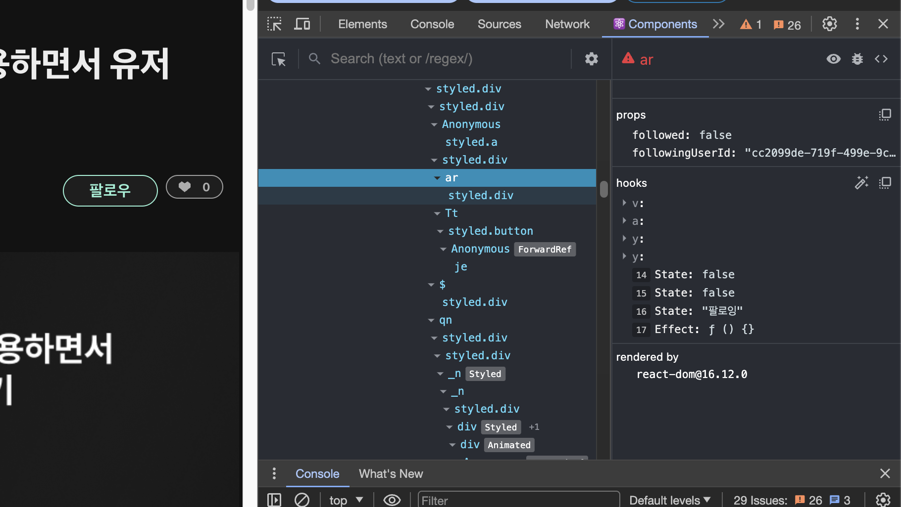
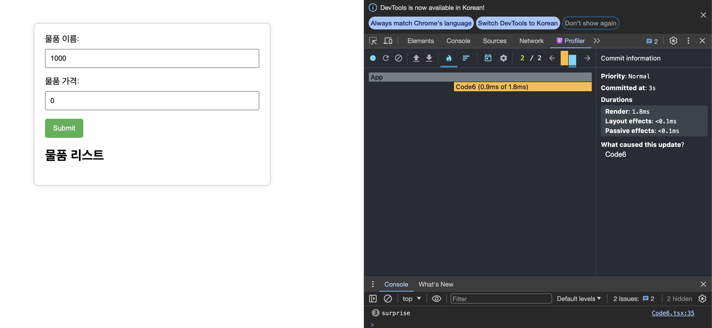

# 6장 리액트 개발도구로 디버깅하기

## 리액트 개발도구란 ?

- 리액트로 만들어진 다양한 어플리케이션을 디버깅하기 위해 만들어진 개발도구
- 리액트 뿐 아니라 리액트 네이티브등 다양한 플랫 폼에서 사용할 수 있다.
- 웹 환경에서는 브라우저 확장 프로그램을 사용하는 것이 편리하다.

## 리액트 개발도구 설치

- 각 브라우저 별 웹 스토어에서 설치를 진행하면 된다.
- (크롬기준) 리액트로 개발되고 접근할 수 있는 페이지의 경우에 아이콘이 활성화 되고, 개발자도구를 열면, 이전에는 없었던 탭인, components 와 profiler 가 활성화 된다.

## 리액트 개발도구 활용하기

### 컴포넌트



#### 컴포넌트 트리

- 리액트 애플리케이션의 전체 트리구조를 한눈에 보여준다.
- 기명함수로 작성한 함수만 정상적으로 컴포넌트 이름을 보여주고, 익명함수로 선언되어있으면 Anonymous 이름으로 컴포넌트를 보여준다.

  ```tsx
  const MemoizedComponent = memo(() => <>MemoizedComponent</>);
  const withSampleHOC = (Component: ComponentType) => {
    return function () {
      return <Component />;
    };
  };
  const HOCComponent = withSampleHOC(() => <>HOCComponent</>);
  export default function App() {
    return (
      <div className="App">
        <MemoizedComponent />
        <HOCComponent />
      </div>
    );
  }
  ```

  위의 코드를 다음 같이 기명함수로 변경해주면, 디버깅이 쉽다.

  ```tsx
  const MemoizedComponent = memo(function MemoizedComponent (){ return <>MemoizedComponent</>}
  const withSampleHOC = ( Component: ComponentType )=>{
  return function withSampleHOC(){
  	return <Component/>
  }
  }
  const HOCComponent = withSampleHOC(function HOCCompoent(){return <>HOCComponent</>})
  export default function App(){
  return (
  	<div className="App">
  		<MemoizedComponent/>
  		<HOCComponent/>
  	</div>
  )
  }
  ```

  또는 함수에 displayName 속성을 추가하는 방법도 있다.

  ```tsx
  const MemoizedComponent = memo(() => <>MemoizedComponent</>);
  MemoizedComponent.displayName = "메모 컴포넌트 입니다";
  ```

  - 함수명과 별도로 특별한 명칭을 부여해서 명시적 확인이 필요한 경우에도 displayName 을 사용하면 좋다.

#### 컴포넌트와 props

- 제공정보
  - 컴포넌트명과 key
  - strict mode 로 랜더링 되지 않은 경우 경고 표시
  - 컴포넌트 props
    - 오른쪽 버튼으로 복사할 수 있다.
    - 함수 prop 의 경우에는 go to definition 으로 선언된 코드로이동해 내용을 수정할 수도 있다.
  - 컴포넌트 hooks
    - use가 생략된 형태로 나타난다. State, Reducer, Context, Memo, Callback ... 이런식이다.
    - 훅에 넘겨주는 함수도 기명함수를 쓰면 개발도구에서 명확하게 확인이 가능하다.
  - 컴포넌트를 랜더링한 주체, rendered by
    - 컴포넌트를 랜더링한 주체를 확인한다.
    - 프로덕션 모드에서는 react-dom의 버전만 알 수 있다.
    - 개발모드에서는 해당 컴포넌트를 랜더링한 부모 컴포넌트 까지 알 수 있다.
- 컴포넌트 도구
  - 눈모양 아이콘: 해당 컴포넌트가 HTML 의 어디에서 랜더링 되었는지 확인 할 수 있다.
  - 벌레 아이콘 : 해당 컴포넌트 정보( 컴포넌트가 받는 props, 컴포넌트 내부에서 쓰는 hooks, 컴포넌트 HTML 요소 nodes ) 가 console.log 에 기록이 된다.
  - 소스코드 아이콘 : 해당 컴포넌트의 소스코드를 확인한다.

### 프로파일링

- 설정
  - 추천 옵션
    - 컴포넌트가 랜더링될때 컴포넌트를 하이라이트 하는 기능
    - 프로파일링 도중 왜 랜더링 되었는 지 기록하는 모드
- 프로파일링
  - 프로파일링 메뉴
    - 리액트가 랜더링하는 과정에서 발생하는 상황을 확인하는 도구
      - 어떤 컴포넌트가 몇번 랜더링되었는지
      - 어떤 작업에서 오래걸렸는지 등을 확인 가능
      - 개발모드에서 실행되는 리액트 애플리케이션에서만 사용이 가능하다.
    - 버튼 순서대로 다음 기능을 수행
      - 1.  StartProfiling
      - 2.  Reload and Start Profiling
      - 3.  Stop Profiling
      - 4.  Load Profile
      - 5.  Save Profile
  - Flamegraph
    - 각 컴포넌트 별 랜더 커밋별 정보를 확인
      - 랜더링 되지 않은 컴포넌트 정보도 확인가능
        - 의도대로 메모이제이션이 작동하고, 랜더링이 발생하는 지 확인에 좋다.
      - 랜더링 속도를 너비와 색으로 표기
        - 너비가 넓을 수록 느리게 랜더링
        - 빠름 [초록 < > 노랑] 느림
    - 컴포넌트 트리구조를 확인할 수 있다.
  - Ranked
    - 랜더링이 오래걸린 컴포넌트 순서대로 나열
    - Flamegraph 와 다르게랜더링이 발생한 컴포넌트만 보여줌
- 타임라인
  - 리액트 18 이상의 환경에서만 확인 가능
  - 시간의 흐름에 따른 리액트 작동을 추적하는 데 사용
  - 무엇이 어느시점에서 랜더링 되었는지 , 리액트의 유휴시간 (작업하지 않고 쉬고 있는 시간) 파악이 가능하다.

## 책의 예제와 정리



- 책에서 input box 의 값이 변화될 때와 같이, 정말 필요한 컴포넌트만 랜더링이 일어나도록 수정하는 예시를 제공하는데, 실제 프로젝트에서는 컴포넌트 구조가 훨씬 복잡하기 때문에, 시간 날때마다 틈틈히 리액트 개발자 도구에 들어가서 최적화할 부분이 있는지 들여다 보는 것이 필요하다.
