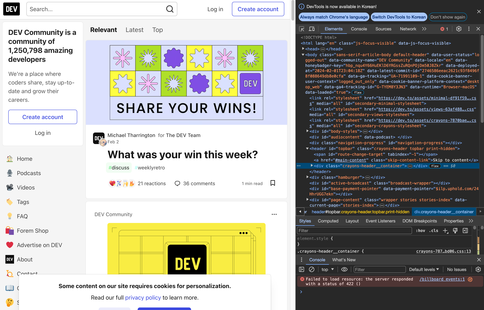
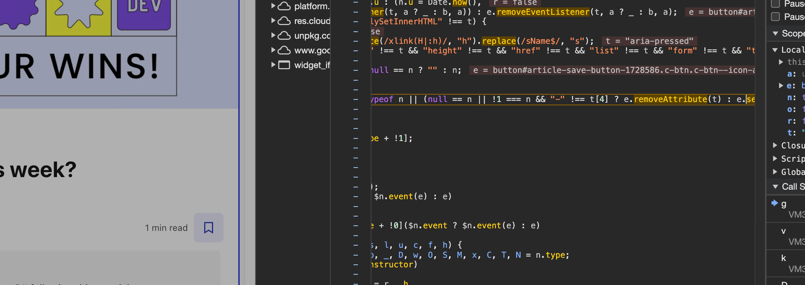
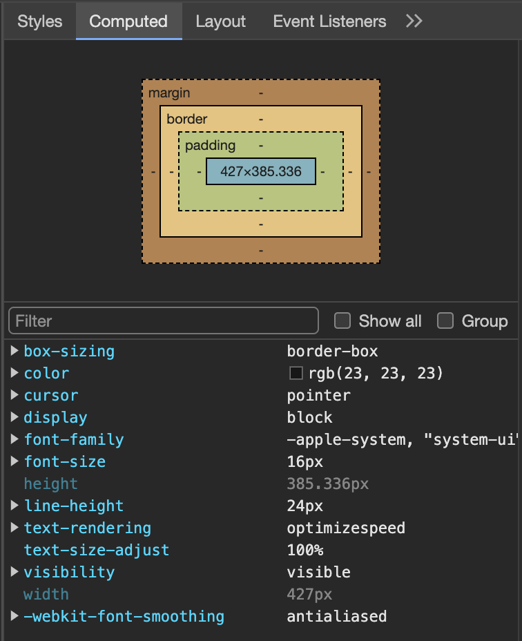
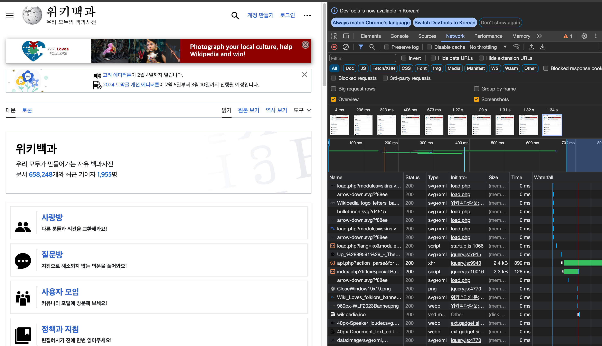
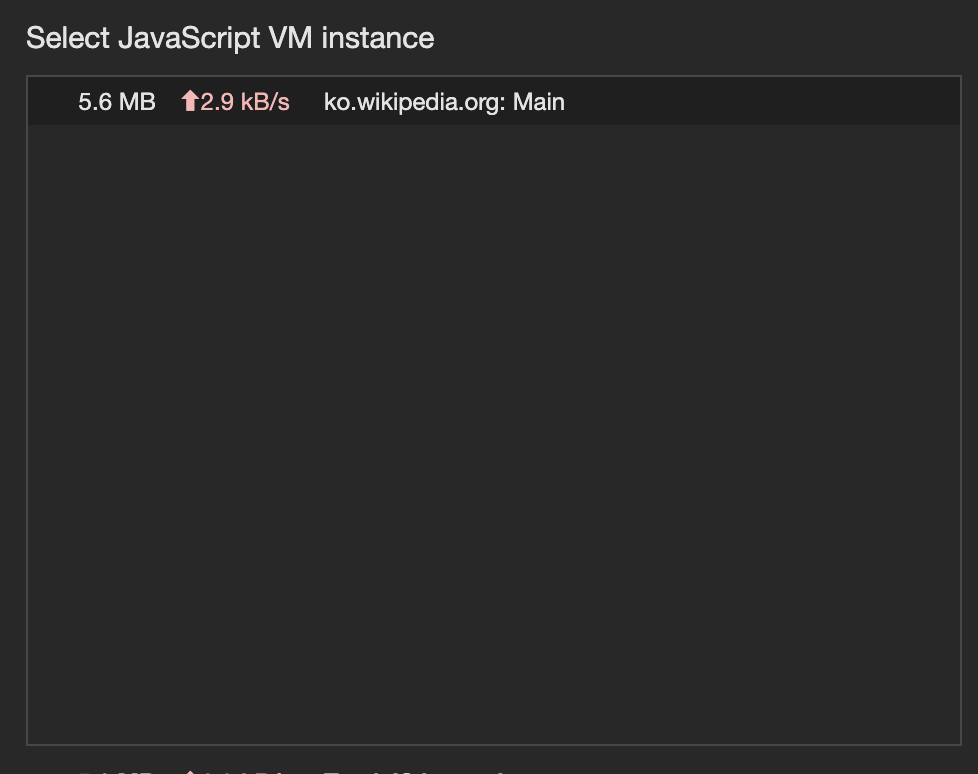
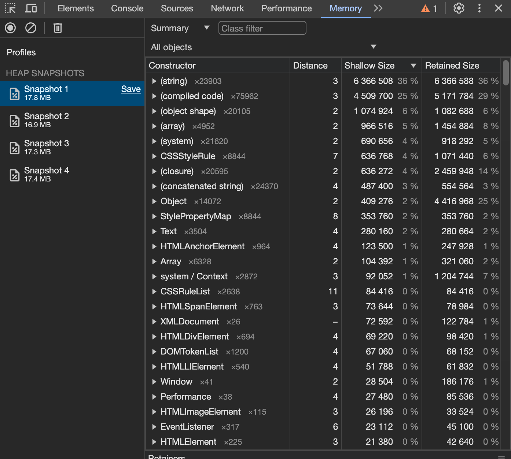

# 7장 크롬 개발자 도구를 활용한 애플리케이션 분석

리액트 밖에서 버그와 디버깅 이슈가 발생할 때가 있다. 브라우저 환경 (자바스크립트 메모리, 네트워크, 소스, HTML 및 CSS )에서 발생할 수 있는 문제를 디버깅 할 수 있는 도구를 브라우저 개발자 도구라고 한다. 모던 브라우저 (크로 , 사파리. 파이어폭스 등 ) 이 제공하는 기능은 거의 유사하며, 이 책에서는 크롬 개발자 도구 macOS용 v105 버전을 말한다.

## 7.1 크롬 개발자 도구란?

크롬에서 제공하는 개발자용 도구

### 개발자용 도구를 열기

- 방법1) 크롬의 메뉴에서 더보기 > 개발자도구
- 방법2) 마우스 오른쪽버튼 > 검사

### 주의사항

크롬 개발자도구에서 웹사이트를 제대로 디버깅하고 싶다면 시크릿 모드로 페이지와 개발자 도구를 열자. 브라우저에 설치되어있는 각종 확장 프로그램에 의해 불필요한 전역변수 HTML 요소들이 추가되는 것을 방지하기 위함이다.

## 7.2 요소 탭

- 개발자 도구에서 첫번째로 노출되어있는 탭. 웹페이지를 구성하는 HTML, CSS 등의 정보를 확인할 수 있다.
  

### 요소화면

- 왼쪽 화면에 표시되는 웹페이지를 구성하는 HTML을 나타내는 화면
- 원하는 태그를 클릭하면 브라우저 페이지의 요소가 강조되고, 해당 요소의 코드를 수정해볼 수 있다.
  - 요소를 더블클릭해서 태그, 클래스 등 요소관련 정보 수정가능
  - 스타일 탭에서 스타일을 수정가능
- 코드에 의해 요소의 속성이 동적으로 제어되는 경우에 요소의 중단점을 사용해서 해당 동작이 일어나게 하는 소스코드를 볼수도 있다. 다음 사진은 포스트를 즐겨찾기 할때 요소의 속성의 변화를 중단점으로 잡은 예시이다.
  

### 요소정보

요소화면에서 선택한 요소의 정보를 보여주는 탭

- 스타일 : 어떤 클래스, 태그명으로 매핑되어 설정된 스타일인지, 소스 파일 연결, 스타일 정보 수정해서 바로 변경사항 확인가능
- 계산됨 (Computed) : 스타일탭이 소스에서 어떻게 스타일이 설정되었는 지볼 수 있다면, 계산됨 탭에서는 최종적으로 어떤 결과물로 나타내는지 확인
    

    
    

- 레이아웃 : CSS 그리드, Flexbox 등 레이아웃 정보확인
- 이벤트리스너 : 현재 요소에 부착된 각종 이벤트 리스너 확인, Ancestors 를 체크 해제하면 정확히 요소에 부착된 이벤트 표시
- DOM 중단점 (DOM Breakpoint) : 중단점이 있는 요소 표시
- 속성 : 해당 요소가 가지는 모든 속성값
- 접근성 : 스크린리더기를 이용해 웹에 접근하는 장애인과 노략자를 위해 활용하는 값 확인

## 7.3 소스 탭

어플리케이션을 불러오기 위해 실행되거나 참조된 모든 파일을 확인가능하다. 디버깅하고 싶은 파일을 열어서 디버깅하면 되는데, 프로덕션의 경우 파일이 압축, 난독화로 인하여 코드를 파악하기가 어렵기 때문에 개발모드에서 실행해서 사용하면 된다.

- 중단점을 생성할 수 있는데, 코드에 debugger 를 선언하는 것과 같이 코드를 오염시키지 않는다.

### 소스탭 제공 정보

- 감시(Watch) : 감시하고 싶은 변수를 선언하고, 해당 변수의 정보를 확인할 수 있는 메뉴. 확인할 수 없는 값은 \<not available> 로 표시됨
- 중단점(Breakpoints) : 현재 웹사이트에 추가한 중단점을 모두 확인
- 범위(Scope): 현재 중단점에서의 스코프를 확인한다. 로컬, 클로저, 전역 스코프 모두 확인가능
- 호출스택(Call Stack): 현재 중단점의 콜스택 확인. 실행 콘텍스트가 어떻게 저장 실행되는 지 확인
- 전역 리스너(Global): 전역 스코프에 추가된 리스너 목록 확인
- XHR/가져오기, DOM, 이벤트 리스너, CSP 위반 중단점: 소스 중단점 이외의 중단점 확인
  Q. 어떤 중단점이 더 있다는 건지 한번 조사해보기

## 7.4 네트워크 탭

- 웹페이지 접속부터 발생하는 모든 네트워크 관련 작동이 기록됨
- All, Doc, JS ... 탭으로 보고 싶은 네트워크 요청 필터링 가능
- 설정의 스크린 샷기능을 켜면, 네트워크 요청 흐름에 따른 스크린샷도 확인이 가능하다.

### 활용

- 리소스 크기가 너무 크지 않은지
- 리소스 다운로드 속도가 너무 느리지 않은지
- 불필요한 요청이 없는지
- 리소스 다운로드가 적절한 순서로 자연스럽게 진행되는지
  위와 같은 사항들을 확인해서 사용성을 개선할 수 있다.
  

## 7.5 메모리 탭

- 어플리케이션에서 발생하는 메모리 누수, 속도 저하, 웹페이지 프리징 현상을 확인
- 리액트 개발도구의 프로파일 탭처럼 프로파일링 작업을 거친 후 정보를 확인

### 프로파일 유형

1. 힙 스냅샷
2. 타임라인의 할당 계측
3. 할당 샘플링

### 자바스크립트 인스턴스 VM 선택하기

현재 실행중인 자바스크립트 가상머신 인스턴스를 선택하고 프로파일링 작업을 시작하면 된다.

### 힙스냅샷

현재 메모리 상태를 확인해 볼 수 있다. 촬영하는 시점의 메모리 현황을 보여준다.

- 메모리 누수 정보를 확인하기 위해서 메모리 누수가 발생할 것으로 예상되는 스크립트 전후로 스냅샷을 찍어서 내용을 비교해보라
- 기명함수를 사용해 내용에서 원하는 함수를 빠르게 찾을 수 있게 하라
- 얕은 크기( 객체자체 크기 ) 와 유지된 크기 ( 객체가 참조하는 모든 객체 크기 )의 차이가 크면 해당 객체가 복잡한 참조 관계를 가진다는 뜻이다.
  

### 타임라인 할당 계측

시간의 흐름에 따라 메모리의 변화를 확인할 수 있는 기능

- 변화를 일으킨 변수와 차지하는 크기 확인
- 시간의 흐름에 따른 메모리 변화를 모두 기록해 부담이 있다.

### 할당 샘플링

할당 계측과 유사하게 시간 흐름에 따라 발생하는 메모리 점유를 확인한다.

- 자바스크립트 실행 스택별 분석
  - 함수단위로 분석
- 할당 계측과 유사하지만 브라우저에 주는 부담이 적어 장시간 디버깅에 유리
- 메모리 누수가 짐작되지만, 힙 스냅샷으로는 비교가 어려운 경우 사용

## 7.6 Next.js 환경 디버깅하기

Next.js 서버환경도 동일하게 크롬 개발자 도구로 디버깅이 가능하다. 프로젝트를 디버그 모드로 실행하고 메모리 탭의 기능들을 이용해서 동일하게 진행하면 된다.
