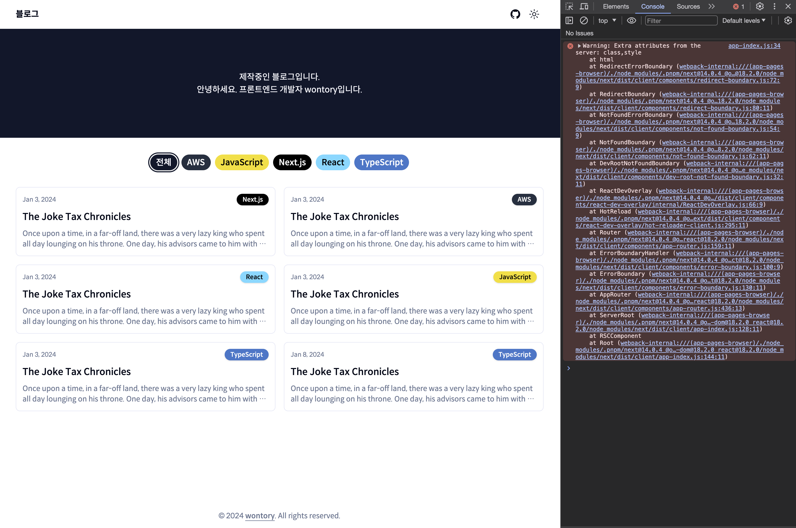
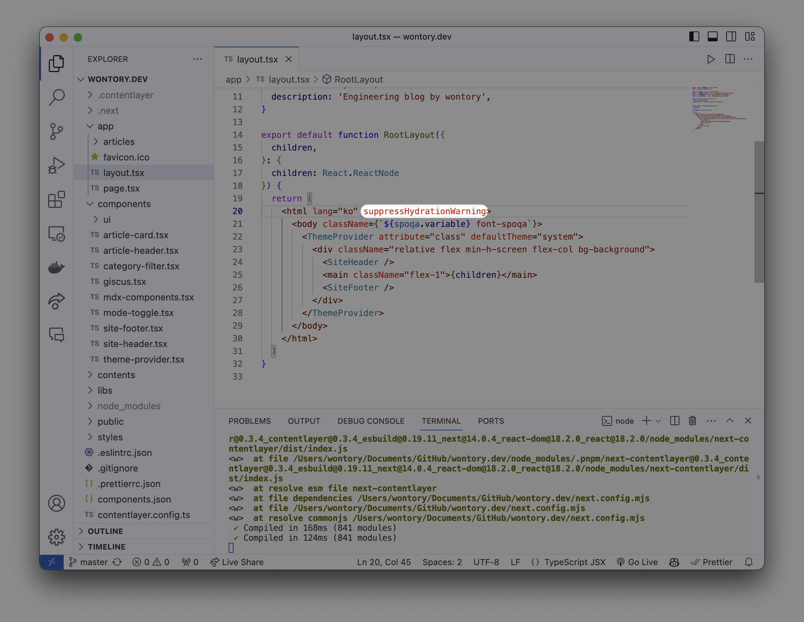
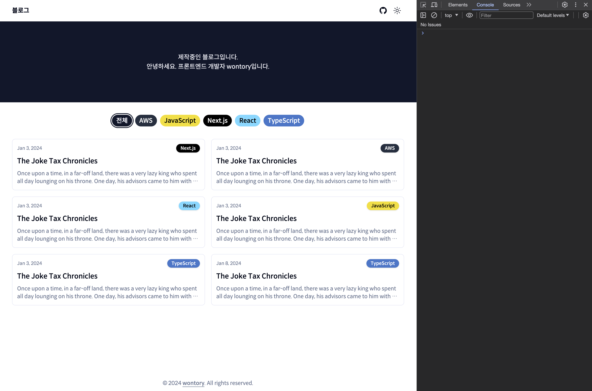

# 1. 서버 사이드 렌더링이란?

## 1. 싱글 페이지 애플리케이션의 세상

### 싱글 페이지 애플리케이션이란?

- 렌더링과 라우팅에 필요한 대부분의 기능을 서버가 아닌 브라우저의 자바스크립트에 의존하는 방식
- 최초에 첫 페이지에서 데이터를 모두 불러온 이후에는 페이지 전환을 위한 모든 작업이 자바스크립트와 브라우저의 `history.pushState`와 `history.replaceState`로 이뤄진다.
  - 페이지를 불러온 이후에는 서버에서 HTML을 내려받지 않고 하나의 페이지에서 모든 작업을 처리
- 장점: 한번 로딩된 이후에는 서버를 거쳐 필요한 리소스를 받아올 일이 적어지기 때문에 사용자에게 훌륭한 UI/UX를 제공한다.
- 단점: 최초에 로딩해야 할 자바스크립트 리소스가 커진다.

### 전통적인 방식의 애플리케이션과 싱글 페이지 애플리케이션의 작동 비교

- 서버 사이드: 페이지 전환이 발생할 때마다 새롭게 페이지를 요청하고, HTML 페이지를 다운로드해 파싱하는 작업으 거친다.
  - 페이지를 처음부터 새로 그려야 해서 일부 사용자는 페이지가 전환될 때 부자연스러운 모습을 보게 된다.
- 클라이언트 사이드: 최초에 한번 모든 리소스를 다운로드하고 나면 이후 페이지를 전환할 때 추가로 리소스를 다운로드하는 시간이 필요 없어진다.
  - 경우에 따라 페이지 전체를 새로 렌더링하는 것이 아니라 페이지 전환에 필요한 일부 영역만 다시 그리게 되므로 훨씬 더 매끄러운 UI를 보여줄 수 있게 된다.

### 싱글 페이지 렌더링 방식의 유행과 JAM 스택의 등장

- 자바스크립트가 서서히 다양한 작업을 수행하게 되면서 자바스크립트를 모듈화하는 방안이 점차 논의되기 시작  
  → CommonJS와 AMD(Asynchronous Module Definition)
- 2010년경 자바스크립트 수준에서 MVx 프레임워크를 구현하기 시작(Backbone.js, AngularJS, Knockout.js 등의 등장)
  - 자바스크립트 개발자들은 웹페이지의 모든 영역(렌더링 ~ 사용자 인터랙션)을 담당하면서 이를 모두 아우를 수 있는 방식인 싱글 페이지 렌더링이 인기를 얻게 됨.
  - 브라우저 내부에서 작동하는 스크립트만 신경쓰면 된다. → 간편한 개발 경험
- 기존 LAMP(Linux + Apache + MySQL + PHP) 스택 → 웹 애플리케이션의 확장성 ↓
- JAM(JavaScript + API + Markup) 스택: 자바스크립트와 마크업을 미리 빌드해 두고 정적으로 사용자에게 제공 → 서버 확장성 문제에서 자유로워짐

> **참고:** https://jamstack.org/

### 새로운 패러다임의 웹서비스를 향한 요구

- 자바스크립트 코드의 규모가 점차 커지면서 자바스크립트 파싱을 위해 CPU를 소비하는 시간이 크게 증가 → 웹페이지 로딩 시간 ↑
- 사용자의 기기와 인터넷 속도 등 웹 전반을 이루는 환경이 크게 개선됐음에도 실제 사용자들이 느끼는 웹 애플리케이션의 로딩 속도는 5년 전이나 지금이나 크게 차이가 없거나 오히려 더 느리다.
- 웹 애플리케이션 개발자라면 웹 서비스의 성능을 역행하는 추세에 책임감을 가질 필요가 있다.

## 2. 서버 사이드 렌더링이란?

- 최초에 사용자에게 보여줄 페이지를 서버에서 렌더링해 빠르게 사용자에게 화면을 제공하는 방식
- 웹페이지가 점점 느려지는 상황에 대한 문제의식을 싱글 페이지 애플리케이션의 태생적인 한계에서 찾고, 이를 개선하고자 다시 서버 사이드 렌더링이 떠오르고 있다.
- 클라이언트 사이드 렌더링은 사용자 기기의 성능에 영향을 받지만 서버 사이드 렌더링은 비교적 안정적인 렌더링이 가능

### 서버 사이드 렌더링의 장점

#### 최초 페이지 진입이 비교적 빠르다.

- 사용자가 최초 페이지에 진입했을 때 페이지에 유의미한 정보가 그려지는 시간(FCP, First Contentful Paint)이 더 빠르다.
  - 일반적으로 서버에서 HTTP 요청을 수행하는 것이 더 빠르다.
  - 서버에서 HTML을 문자열로 미리 그려서 내려주는 것이 클라이언트에서 기존 HTML에 삽입하는 것보다 더 빠르다.

> 참고: [웹사이트 실적에 대한 활용 가능한 분석 정보 얻기](https://developer.chrome.com/docs/devtools/performance-insights?hl=ko)

#### 검색 엔진과 SNS 공유 등 메타데이터 제공이 쉽다.

- 검색 엔진이 사이트에서 필요한 정보를 가져가는 과정
  1. 검색 엔진 로봇(머신)이 페이지에 진입한다.
  2. 페이지가 HTML 정보를 제공해 로봇이 이 HTML을 다운로드한다. 단, 다운로드만 하고 자바스크립트 코드는 실행하지 않는다.
     - 로봇은 페이지를 보는 것이 아닌 페이지의 정적인 정보를 가져오는 것이 목적이므로 자바스크립트를 다운로드하거나 실행할 필요가 없다.
  3. 다운로드한 HTML 페이지 내부의 오픈 그래프(Open Graph)나 메타(meta) 태그 정보를 기반으로 페이지의 검색(공유) 정보를 가져오고 이를 바탕으로 검색 엔진에 저장한다.
- 검색 엔진에 제공할 정보를 서버에서 가공해서 HTML 응답으로 제공할 수 있으므로 검색 엔진 최적화에 대응하기가 매우 용이

> **참고:** [Robots.txt 소개](https://developers.google.com/search/docs/crawling-indexing/robots/intro?hl=ko)

#### 누적 레이아웃 이동이 적다.

- 누적 레이아웃 이동(CLS, Cumulative Layout Shift): 사용자에게 페이지를 보여준 이후에 뒤늦게 어떤 HTML 정보가 추가되거나 삭제되어 마치 화면이 덜컥거리는 것과 같은 부정적인 사용자 경험
- 서버 사이드 렌더링을 사용한다 해도 이러한 문제에서 완전히 자유롭지는 못하다.
  - `useEffect` → Next.js에서는 React 클라이언트 훅을 사용하려면 클라이언트 컴포넌트로 변경해줘야 함.(`'use client'`)
  - API 속도가 모두 달랐을 때, 최초 페이지 다운로드가 느려진다. → [스트림](https://nextjs.org/learn/dashboard-app/streaming)

#### 사용자 디바이스 성능에 비교적 자유롭다.

- 자바스크립트 리소스 실행은 사용자의 디바이스에서 실행되므로 절대적으로 사용자 디바이스 성능에 의존적
- 서버 사이드 렌더링을 수행하면 이러한 부담을 서버에 나눌 수 있으므로 사용자의 디바이스 성능으로부터 조금 더 자유로워질 수 있다.
  - 인터넷 속도
  - 사용자 방문 증가로 서버에 부담이 가중되는 경우 등의 경우를 고려해야 함

#### 보안에 좀 더 안전하다.

- JAM 스택의 문제점은 애플리케이션의 모든 활동이 브라우저에 노출된다는 것
  - API 호출, 인증 등의 민감한 작업도 포함된다.
- 서버 사이드 렌더링의 경우 민감한 작업을 서버에서 수행하고 그 결과만 브라우저에 제공해 이러한 보안 위협을 피할 수 있다.

### 단점

#### 소스코드를 작성할 때 항상 서버를 고려해야 한다.

- 브라우저 전역 객체인 `window` 또는 `sessionStorage`와 같이 브라우저에만 있는 전역 객체 등이 서버 사이드에서 실행되지 않도록 처리해야 한다. (외부 라이브러리 포함)

#### 적절한 서버가 구축돼 있어야 한다.

- 사용자의 요청을 받아 렌더링을 수행할 서버가 필요하다.
  - 사용자의 요청에 따라 적절하게 대응할 수 있는 물리적인 가용량 확보
  - 예기치 않은 장애 상황에 대응할 수 있는 복구 전략
  - 요청을 분산시키고, 프로세스가 예기치 못하게 다운될 때를 대비해 PM2와 같은 프로세스 매니저의 도움 필요

#### 서비스 지연에 따른 문제

- 애플리케이션의 규모가 커지고 작업이 복잡해지고, 이에 따라 다양한 요청에 얽혀있어 병목 현상이 심해진다면, 서버 사이드 렌더링이 더 안 좋은 사용자 경험을 제공할 수도 있다.

## 3. SPA와 SSR을 모두 알아야 하는 이유

### 서버 사이드 렌더링 역시 만능이 아니다.

### 싱글 페이지 애플리케이션과 서버 사이드 렌더링 애플리케이션

- 싱글 페이지 애플리케이션
  - 최초 페이지 진입 시에 보여줘야 할 정보만 최적화해 요청 및 렌더링
  - 이미지 등 중요성이 떨어지는 리소스는 lazyloading 처리
  - 코드 분할로 불필요한 자바스크립트 리소스의 다운로드 및 실행 방지
  - 라우팅 발생 시 변경이 필요한 HTML 영역만 교체해 사용자의 피로감 최소화
- 멀티 페이지 애플리케이션
  - 페인트 홀딩(Paint Holding): 같은 출처에서 라우팅이 일어날 경우 화면을 잠깐 하얗게 띄우는 대신 이전 페이지의 모습을 잠깐 보여주는 기법
  - back forward cache(bfcache): 브라우저 앞으로 가기, 뒤로가기 실행 시 캐시된 페이지를 보여주는 기법
  - Shared Element Transitions: 페이지 라우팅이 일어났을 대 두 페이지에 동일 요소가 있다면 해당 콘텍스트를 유지해 부드럽게 전환되게 하는 기법

### 현대의 서버 사이드 렌더링

- 최초 웹사이트 진입 시에는 서버 사이드 렌더링 방식으로 서버에서 완성된 HTML을 제공받음
- 이후 라우팅에서는 서버에서 내려받은 자바스크립트를 바탕으로 마치 싱글 페이지 애플리케이션처럼 작동

> 참고: [Next.js - Automatic code-splitting and prefetching](https://nextjs.org/learn/dashboard-app/navigating-between-pages#automatic-code-splitting-and-prefetching)

&nbsp;

# 2. 서버 사이드 렌더링을 위한 리액트 API 살펴보기

## 1. `renderToString`

- 서버 사이드 렌더링을 구현하는 데 가장 기초적인 API
- 리액트 컴포넌트를 렌더링해 HTML 문자열로 반환하는 함수
- `useEffect`와 같은 훅과 `handleClick`과 같은 이벤트 핸들러는 결과물에 포함되지 않음
  - 서버 사이드 렌더링은 단순히 '최초 HTML 페이지를 빠르게 그려주는 데'에 목적이 있기 때문
  - 실제로 웹페이지가 사용자와 인터랙션할 준비가 되기 위해서는 이와 관련된 별도의 자바스크립트 코드를 모아 다운로드, 파싱, 실행하는 과정을 거쳐야 한다.
- `data-reactroot` 속성: 리액트 컴포넌트의 루트를 식별하는 기준점

## 2. `renderToStaticMarkup`

- `renderToString`과 유사하지만, 리액트에서만 사용하는 추가적인 DOM 속성(`data-reactroot` 등)을 만들지 않는다.
- `hydrate`를 수행하지 않는다는 가정 하에 순수 HTML만 반환한다. → 정적인 내용만 필요한 경우에 사용

## 3. `renderToNodeStream`

- `renderToString`과 결과물이 완전히 동일하지만, 브라우저에서 사용할 수 없다. → 완전히 Node.js 환경에 의존
- `renderToString`의 결과물 타입은 `string`인 반면, `renderToNodeStream`의 결과물 타입은 Node.js의 `ReadableStream`
  - `utf-8`로 인코딩된 바이트 스트림으로 Node.js 환경에서만 사용할 수 있다. → `string`을 얻기 위해서는 추가적인 처리가 필요
  - `ReadableStream` 자체는 브라우저에서도 사용할 수 있는 객체이지만, `ReadableStream`을 만드는 과정이 브라우저에서 불가능하게 구현돼 있음.
- 스트림: 큰 데이터를 다룰 때 데이터를 청크(chunk, 작은 단위)로 분할해 조금씩 가져오는 방식
  - `renderToString`이 생성하는 HTML 결과물의 크기가 작다면 상관 없지만, 매우 커진다면 Node.js가 실행되는 서버에 큰 부담이 될 수 있다.
  - 대부분의 리액트 서버 사이드 렌더링 프레임워크는 모두 `renderToNodeStream`을 채택하고 있다.

## 4. `renderToStaticNodeStream`

- Node.js 환경의 `renderToStaticMarkup`

## 5. `hydrate`

- `renderToString`과 `renderToNodeStream`으로 생성된 HTML 콘텐츠에 자바스크립트 핸들러나 이벤트를 붙이는 역할
- `render`는 클라이언트에서만 실행되는 렌더링과 이벤트 핸들러 추가 등 리액트를 기반으로 한 온전한 웹페이지를 만드는 데 필요한 모든 작업을 수행
- `hydrate`는 이미 렌더링된 HTML이 있다는 가정하에 작업이 수행 → 이벤트를 붙이는 작업만 실행
  - `hydrate`가 수행한 렌더링 결과물 HTML과 인수로 넘겨받은 HTML을 비교해 불일치가 발생하면 `hydrate`가 렌더링한 기준으로 웹페이지를 그리게 된다.  
    → 정상적으로 웹페이지가 만들어지고 렌더링된다고 해도 올바른 사용법은 아니다.
    - 사실상 서버와 클라이언트에서 두 번 렌더링을 하게 되므로, 서버 사이드 렌더링의 장점을 포기하는 것
- 불가피하게 불일치가 발생할 수 있는 경우에는 해당 요소에 `suppressHydrationWarning`을 추가해 경고를 끌 수 있다.  
  → 경고를 끄는 것이지 문제가 해결된 것이 아니다.
  - 필요한 곳에서만 제한적으로 사용해야 한다.

&nbsp;

# 3. Next.js 톺아보기

## 1. Next.js란?

- 리액트 기반 서버 사이드 렌더링 프레임워크
- 디렉터리 기반 라우팅
